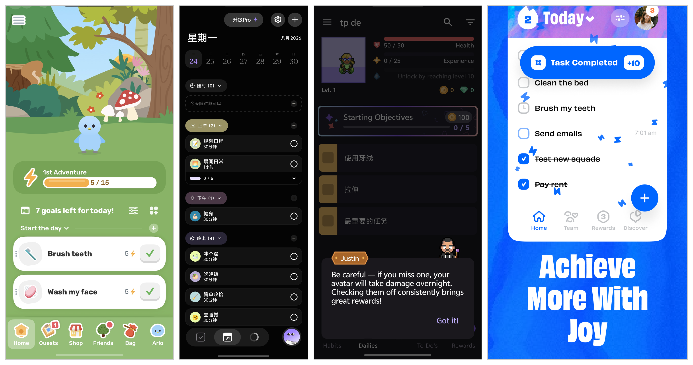
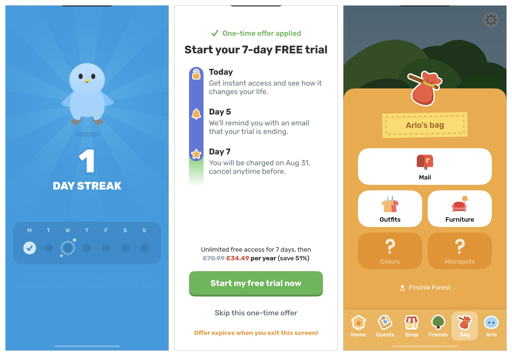
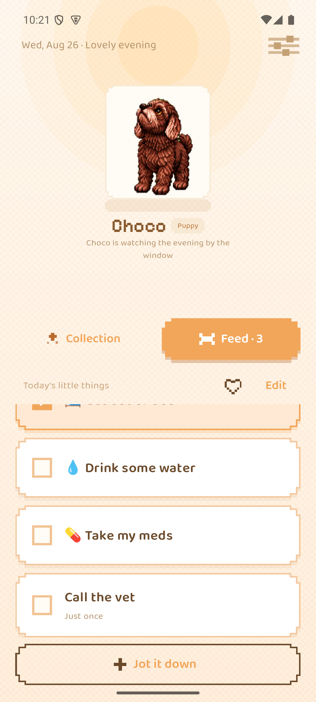
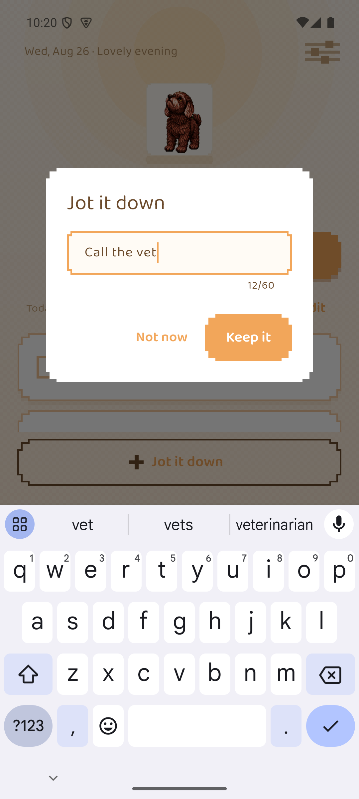
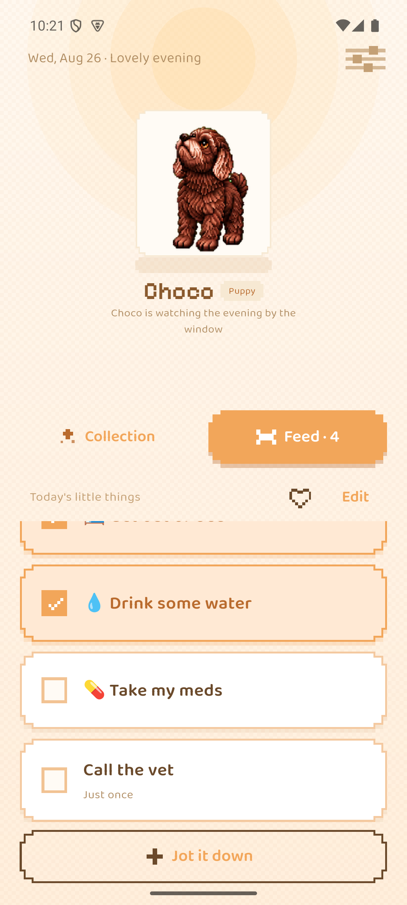
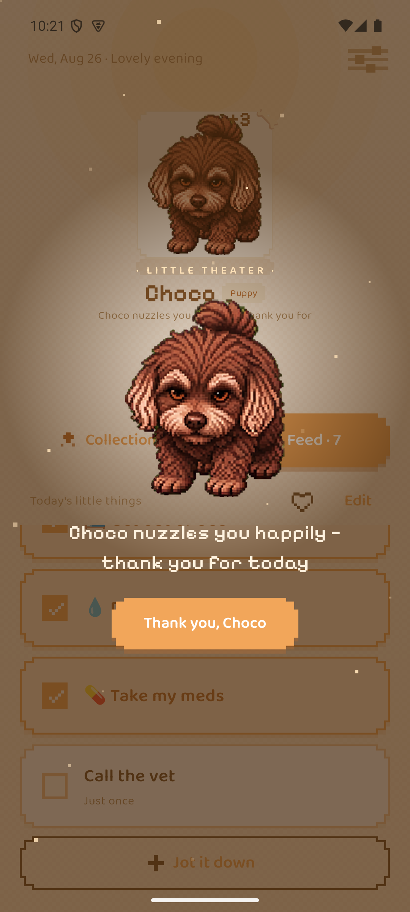
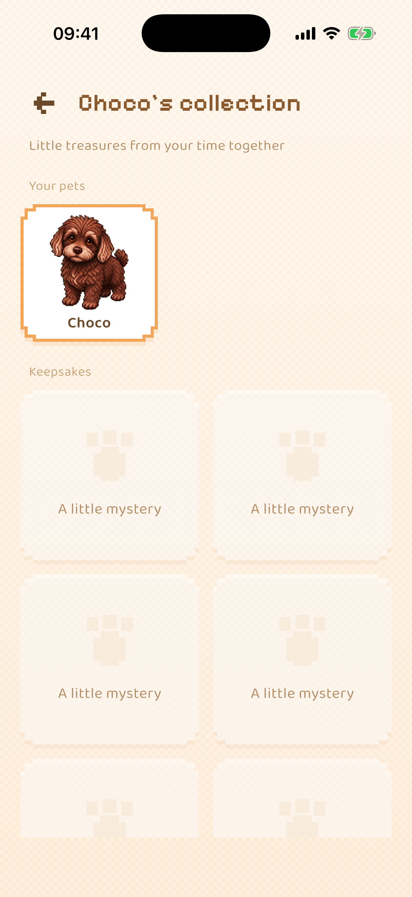
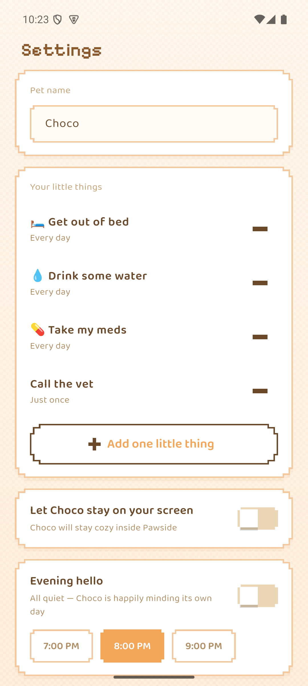

# Pawside — 进度报告(中文审察稿)

*(原名 PetTodo)*

> 本稿是英文提交稿的逐节中文对照,仅供内部审阅;提交与措辞以英文版为准。图表与英文版共用。

---

## 摘要

Pawside 是一款面向 ADHD 成年人的手机待办应用,iOS 与 Android 共用一套 Flutter
代码。出发点很简单:对这个人群,温和的提醒很难让一件事真正开始,而外部锚点——
孩子、宠物、一个依赖你的人——常常可以。所以 Pawside 不发提醒,而是给用户一只
虚拟宠物——从九只预置猫狗里领养一只,或者作为一次性解锁、用自家动物的照片生成
——再把一张小小的每日任务清单变成"我们一起做的事"。
安全规则——不惩罚、无连击(streak)、无失败态——直接写进数据模型,而不是靠自觉
维持。

为写这份报告,我用四类证据检验了这个想法:社区叙述、4,754 条应用商店评论、
一次结构化文献检索,以及构建本身。最重要的发现对设计不利:锚点假设是整个设计里
证据最薄弱的部分,而它想取代的"提醒+计划"路线,在确诊 ADHD 样本里反而有对照
实验证据。安全规则经受住了更多检验,但针对无角色、无失败态的自我追踪器的研究
表明:去掉惩罚并不会自动去掉内疚。

截稿时,核心循环在双端完整可用,58 个自动化测试全部通过。期中之后,项目又交付了
像素风改版、Android 常驻宠物悬浮层、一条约一分钟把照片变成会动宠物的新生成管线,
以及围绕关系重做的 onboarding。能检验锚点机制的用户研究已经设计就绪,但塞不进项目窗口;报告对"没有它,什么
能主张、什么不能"写得清清楚楚。

---

## 1. 引言

### 1.1 背景与动机

大多数任务管理软件都假设用户有能力维护它。对 ADHD 成年人来说,这个假设是反的:
维护一个效率工具所需的心智能力,恰恰是受损的那部分。具体受损的能力是前瞻记忆
(prospective memory)——在正确的时刻想起去做一件事——而且它的失效并不均匀。
一项病例对照实验里,25 名确诊 ADHD 的成年人在*时间触发*的意图上("晚上 7 点做
X")严重受损,但在*事件触发*的意图上("晚饭后做 X")表现与匹配对照组相当
([Altgassen, Kretschmer & Kliegel 2014](https://doi.org/10.1177/1087054712445484),
《Journal of Attention Disorders》)。这个人群还非常异质:在六个神经心理学维度上,
没有任何单一缺陷出现在多数确诊个体身上——按维度不同只覆盖 18.1% 到 36.1%
([Coghill et al. 2014](https://doi.org/10.1017/s0033291713002547),《Psychological
Medicine》)。因此,一个工具无论构建哪种机制,帮到的都只是一个亚群体,而不是
全体——这一点同样适用于本项目想改进的提醒机制。

ADHD 人群自己说有效的办法,都是具体而外部的:一个孩子、一条必须遛的狗、一只放在
房间另一头的闹钟——而不是励志话术。Pawside 要问的是:这个观察经不经得起被做成
产品——由用户自家动物生成的虚拟宠物,能否充当小型日常任务的外部锚点?

### 1.2 目标

构建并评估一款待办应用:它的吸引力机制是外部锚点而非提醒,同时不引入让同类应用
被弃用的内疚。目标:(i) 双端核心循环完全离线运行,无账号、无服务器;(ii) 一只
用户在乎的宠物——预置猫狗名册让不养宠物的人也能完整使用这款应用,而差异化的
解锁项是由用户*自家*动物生成的宠物,假设是"对真实、可辨认的同伴的依恋,强于对
通用形象的依恋";
(iii) 安全红线——不惩罚、无连击、无失败态——由代码结构保证,而不是靠自律;
(iv) 按一条留存标准做评估,且这条标准本身也要被审视,而不是照单全收。

### 1.3 背景

#### 1.3.1 问题:不是缺功能,而是被弃用

这个品类怎么失败,记录得最好的是它自己的用户。我读了 r/ADHD、r/adhdwomen、
r/ADHD_Programmers 三个版块的高热度帖子——包括一篇 4,625 赞、讲述 500 天试遍
36 款效率应用的自述——反复出现三个模式。第一,功能齐全解决不了问题:得票最高的
例子,是一位用户给自己做了一个能读邮件、自动排优先级、每天早上主动联系他的应用,
结果他还是不用。障碍不是摩擦,而是"开始"本身。第二,维护工具本身就是一件消耗
执行功能的事,所以工具恰好在用户垮掉的时候一起垮掉。第三,这个社区有自己的评估
标准:早期好评毫无价值,因为 ADHD 用户天然追新,只有两周留存才有说服力。一位
"连环弃用者"贡献了本项目如今刻意反着设计的那句话:一个"感觉像我那位失望的
母亲"的应用——用户"为了不再因任务内疚而下载了它,结果又开始因它而内疚"。
评论区给这种状态起了名字:*羞耻提醒器(shame reminder)*。

#### 1.3.2 现有系统调研

我用为本报告收集的 4,754 条商店评论(方法与采样口径见第 2.2 节)、公开商店元数据,
以及在我自己设备上逐个上手的体验,调研了这个领域的四款主流应用。图 1 每款各选
一屏。

**图 1 — 四款被调研的应用。**从左到右:Finch(宠物在当日自理任务上方)、Tiimo
(可视化时间轴规划)、Habitica(RPG 属性;引导文案警告 "if you miss one, your
avatar will take damage overnight"——错过一项,你的角色会在夜里掉血)、Numo
(带即时积分奖励的任务清单)。Finch、Tiimo、Habitica 摄于我自己的 Android 真机
(Tiimo 为中文界面);Numo 一格用的是开发商自己的商店宣传图,因为正确的 Numo
未能在截稿前补拍。

**Finch**(虚拟小鸟+自理任务;App Store 73.9 万评分 4.9★,Play 安装量 1000 万+)
是品类第一,也是宠物机制的参照产品。情感联结语言("my birb"、"companion"、
"attached")在其近期苹果评论里无提示自发出现的比例是 29%,另外三款只有
9–13%——这是"宠物机制确实做到了别的机制做不到的事"最清晰的外部证据。它的失败
模式同样有教学意义:一旦中断,内疚重到用户干脆不再打开;为了给宠物挣奖励而伪造
完成,用户一边造假一边意识到是自我欺骗;成年人反复抱怨画风幼稚;还有 Android 侧
得票最高的投诉——数据丢失,养了几年的宠物被清空,用户明确要求一个产品至今不给的
手动备份按钮。一条详细的评论还标出了这个机制的有效范围:宠物奖励推不动大目标
("给虚拟小鸟买衣服当奖励,不足以构成动力"),但推得动小的日常维护——喝完一瓶
水、拉伸、按时吃药——而且应用是*为了看宠物*才被打开的,提醒只是顺带被看到。

**Tiimo**(可视化日程规划;拿过 Apple 年度应用)累计 4.6★ 与近期评论严重背离,
近期评论 28.6% 是一星;投诉最集中的是通知,而且它在 Android 上几乎不存在。
**Habitica**(RPG 式游戏化,Play 500 万+)是本项目红线所回应的"惩罚问题"最清楚
的示范:它最愤怒的评论都是关于在 boss 战里掉级,还有一道拖了多年、至今未愈的
伤口——Android 通知在电池管理下失效,或者积压成堆一次性轰炸。**Numo** 自我定位
是"不幼稚的 ADHD 应用"——与本项目瞄准的位置相同——但正在把它烧掉:29% 的评论
与扣费纠纷有关,Android 评分已塌到 3.29★。更新的一批任务型应用(Hyper、
TaskHero、LifeUp)用"升级打怪,而不是被指挥"争夺同一批用户。

**图 2 — 品类第一名身上,Pawside 刻意不做的三个机制。**从左到右:Finch 的连击
计数("1 DAY STREAK")、带倒计时的七天免费试用弹窗、装扮商店。三者各对应一种
有据可查的失败模式:连击对应中断内疚,订阅压迫对应品类级扣费投诉,装扮奖励对应
宠物机制的天花板。

三个「不做」各有证据,不是审美偏好。连击计数把「漏掉一天」变成一个肉眼可见的
失败态:上文评论显示断签的内疚重到用户不再打开应用,而第 1.3.3 节表明连*没有*
失败态的追踪器都会催生弃用内疚——streak 等于主动制造那种驱动弃用的自我审判;
对 ADHD 用户,漏掉几天本来就是病症的日常质感,不是意志失败。试用倒计时把这款
应用声称要服务的那种损伤直接变了现——忘记取消*就是*一次执行功能失误——而
Numo 的口碑塌方展示了被抓到这么做的代价。装扮商店则坐在宠物机制已知的天花板
上:商店奖励推不动行为("给虚拟小鸟买衣服"),而商店越丰富,越诱导用户已经在
自述的伪造完成。这就是为什么 Pawside 的零食是唯一货币、只花在宠物身上、买不了
别的任何东西。

由此得出三条设计结论。宠物-联结机制成立,而且天花板还没被碰到。数据丢失对情感型
产品是生死问题——对 Pawside *更是*,因为它的宠物不可替代、存储只在本地。订阅
暗黑模式是品类级的信任崩塌,竞争者只要不犯,就完成了差异化。

#### 1.3.3 设计前提的证据

写这份报告之前,我把锚点机制当作已确立的结论,把安全规则当作显然充分。我围绕
十六个问题做了一次结构化文献检索来核查这两件事(方法见第 2.2 节)。结果两边的立场
都被改变了,本报告陈述修正后的立场,而不是为原立场辩护。

**锚点机制并不是已确立的结论。**"身体加倍(body doubling)"——有人在旁边一起
工作——唯一的对照实验在 26 名被试上结果为零
([Schuenke et al. 2025](https://doi.org/10.1145/3663547.3759743));更宽泛的
社会助长元分析里,"仅仅有人在场"只解释 0.3–3% 的方差,而且会*损害*复杂任务
表现([Bond & Titus 1983](https://doi.org/10.1037/0033-2909.94.2.265))。
"照顾动物能帮助 ADHD 成年人启动任务"从未被检验过。我检索到的一切,都不支持
*有人在场有效 → 对动物负责有效 → 照片生成的虚拟动物有效* 这条链。所以 Pawside
是在**检验**一个机制,不是在实现一个已被证明的机制,本报告的所有表述都按此口径。

**被它否定的路线反而有效。**if-then 执行意图计划能改善确诊 ADHD 儿童的抑制、
转换与抗干扰
([Gawrilow & Gollwitzer 2008](https://doi.org/10.1007/s10608-007-9150-1)),
其底下还有一个大规模的普通人群元分析
([Gollwitzer & Sheeran 2006](https://doi.org/10.1016/s0065-2601%2806%2938002-1))。
"提醒没用,锚点有用"这句口号把证据的强弱顺序说反了。

**去掉惩罚不等于去掉内疚。**在无角色、无失败态、无惩罚反馈的自我追踪器里,弃用后
的内疚照样出现——16.2% 的运动手环用户
([Epstein et al. 2016](https://doi.org/10.1145/2858036.2858045))——因为内疚由
用户自己的自我评判生成。给东西一张脸,会独立地抬高抛弃它的心理成本
([Chandler & Schwarz 2010](https://doi.org/10.1016/j.jcps.2009.12.008));对 582
篇 r/Replika 帖子的分析发现,伤害经由角色代入发生:用户觉得角色有需求,而自己
有义务去满足
([Laestadius et al. 2024](https://doi.org/10.1177/14614448221142007))。零惩罚
红线是必要的,但不充分;*羞耻提醒器*的发现从用户侧说的是同一件事。

**唯一操纵过宠物反馈效价的实验,发现"只有温暖"无效。**虚拟宠物同时给正负反馈
的青少年,吃早餐的概率大约翻倍;只给正反馈的宠物没有胜过对照组
([Byrne et al. 2012](https://doi.org/10.1080/17482798.2011.633410))。样本是
青少年,结局指标是早餐,内疚没有被测量——但这是与本项目核心安全规则最接近的
现有检验,而且它并不令人安心。我把这条规则保留为伦理承诺;评估必须有能力看出
"只有温暖"是否*足够*。

**撤回三条我此前反复讲的说法。**"前额叶切换到杏仁核"的紧迫感启动叙事经不起
对原始文献的核对:那个发现讲的是急性不可控应激造成*损害*,而且主要在动物身上
([Arnsten 2015](https://doi.org/10.1038/nn.4087)),而 ADHD 的前额叶是*低*活跃。
"单机制 ADHD 干预 5–10% 迁移率"在文献里不存在,降级为口耳相传的从业者观点。
1–7 任务上限也不能引用 Miller:"七加减二"讲的是即时记忆广度,Cowan 直言那个七
是修辞手法([Cowan 2001](https://doi.org/10.1017/s0140525x01003922))。这个上限
改由第 1.3.2 节的有效范围观察来辩护:小的日常维护,是宠物机制唯一起作用的地方。

**证据支持什么。**"只有温暖"的*强化*有一条直接的 ADHD 结果:在激励 go/no-go
任务上,ADHD 被试从社会奖励——正面的面部表情——获益比对照组更多
([Kohls et al. 2009](https://doi.org/10.1186/1744-9081-5-20))。而事件触发线索是
现有交互选择里证据基础最好的一个,依据就是第 1.1 节的前瞻记忆分离。值得一提的是,
导师转来的早期特殊教育专家反馈独立提出的也是这种线索——具体的相对锚点("我们能
不能在他们做好午饭之前把这个做完")——而不是我目前实现的按时钟触发的每日提示。

---

## 2. 方法

### 2.1 工程方法

**平台:Flutter,而不是两套原生。**两条路都能做出好产品,决定性因素是规模:评估
需要真实用户用自己手里的手机,而一个单人项目养不起两套原生代码到这个标准。代价
是公开接受的:Flutter 够不到的表面必须用原生写——Android 悬浮层就是这么做的
(Kotlin,第 3.4 节),iOS 小组件将来同理。

**架构:先定边界,再堆功能。**图 3 是代码结构。`lib/domain/` 是纯 Dart、不 import
Flutter,产品的规则都归它管——1–7 任务上限、本地日翻转、只记正向的历史、零食
经济、解锁阈值;`lib/data/` 管存储、通知调度和宠物包安装;`lib/sprite/` 管宠物
渲染;`lib/application/` 是一个对界面一无所知的协调层,刻意放在 `lib/ui/` 之外。

**图 3 — 代码结构。**Flutter 应用本体,加上活在应用之外的两块:把照片变成宠物的
孵化链路,和 Flutter 够不到的原生表面。

依赖箭头只允许指向一个方向,安全规则因此可测。看一次点击怎么穿过各层就明白了:
用户勾掉一个任务,widget 调协调层;协调层请 domain 层完成该任务;domain 层校验
规则、产出一条完成事件和一颗零食;data 层把事件追加进日志、原子地重写状态文件;
UI 从新状态重建,sprite 层播放开心动画。任何 widget 都碰不到存储,任何规则的测试
都不需要 widget。这道边界在实践里被验证了两次:先是定稿视觉的落地,后是整个像素
改版(第 3.3 节),都没动 domain 逻辑一行。

**渲染:一个小小的 `CustomPainter`,不上游戏引擎。**Flame 也能干这活,做游戏它是
显然之选。但为一个会动的角色引入游戏引擎不成比例,而且会把动画状态挪出测试能
覆盖的层。

**数据:本地文件,不用数据库、不上云。**状态是一份带版本号的 JSON 文档,写入走
flush-then-rename;事件是只追加的按行 JSON。SQLite 也是完全合格的替代——但文件
让导出导入保持人类可读、除一个版本字段外不需要任何迁移工具,还让"你的数据就是
一个你拿得住的文件"字面为真。没有账号、没有服务器、没有埋点。理由一半是伦理
——社区调研里明确记录了用户拒绝把心理健康相关数据交给小开发者的云服务——一半是
方法论:这让评估不依赖数据基础设施就能进行。第 5 节记录了代价:留存没法按任何被引
研究的方式测量。项目现在唯一的服务器,孵化代理(第 3.5 节),不保存用户数据:它存在
的意义是让图像模型的 key 不进设备,并执行配额。

**流程。**每个改动都从一张书面任务规格开始:目标、文件范围、约束、验收标准写在
动工之前;我只在读完全量 diff、本地跑过构建和测试之后才接受一个改动;用户可见的
改动还要在真机或模拟器上走查。每个功能必须说清它解决哪一个 ADHD 问题;说不清,
就不做。这部宪法与代码一起写下并进版本控制,其中多条规则由测试而非自律来执行
(第 5 节)。

表 1 汇总了主要设计决策、每项最强的替代方案,以及拍板的依据。

**表 1 — 设计决策与被权衡过的替代方案。**

| 决策 | 选择 | 有力的替代 | 拍板依据 |
|---|---|---|---|
| UI 框架 | Flutter | Swift + Kotlin 两套原生 | 都能做出高质量 UI;一套代码让单人项目在双端都够得着评估 |
| 宠物渲染 | `CustomPainter` + `Ticker` | Flame 游戏引擎 | 一个会动的角色撑不起一个引擎;动画状态留在被测层 |
| 存储 | 带版本 JSON + JSONL 日志 | SQLite | 都可靠;文件让导出人类可读,"无服务器"的承诺字面为真 |
| 动画来源 | 4 张生成姿势图+模板骨架 | 每一帧动画都单独生成一张图 | 都能生成可辨认的宠物;逐帧路线每只约 40 分钟且帧间漂移,骨架路线约 1 分钟且动作确定(第 3.5 节) |
| 视觉风格 | 像素风("Cozy Pixel") | 照片衍生的柔和风 | 柔和风温度好但撑不住稳定剪影(第 4.4 节);像素稳定,还回应了"幼稚"的指控 |
| 通知线索 | 事件触发(规划中,第 6 节) | 按时钟触发 | ADHD 成年人的时间触发前瞻记忆受损,事件触发被豁免 |

### 2.2 研究方法

四类证据,刻意选了不同性质,好让它们互相校验。

*社区叙述。*我分两轮读了三个 ADHD 版块的高热度帖子和高票评论——一轮关于工具
弃用,一轮关于这个状况的日常质感——逐帖记录链接和票数,让每条论断都可回溯。

*商店评论。*我通过苹果公开评论 feed 收了 1,154 条(Finch 400、Tiimo 350、Numo
254、Habitica 150),通过 Play 抓取器收了 3,600 条(Finch 1,612、Habitica 1,537、
Numo 339、Tiimo 112),Play 侧刻意超采一到三星。这个选择被标注在每一个受它影响的
数字旁边:Play 比例反映的是投诉的*集中度*,不是人群里的普遍度。

*文献。*我围绕十六个问题做了结构化检索,覆盖机制、安全规则和我此前反复讲的
说法。与预期相反的证据被当作最有价值的产出;确实查无实据时,就如实记"未找到可信
证据",而不是拿相邻结论顶替。产出是一张 230 行的引文表,逐行记录研究设计、样本、
人群错配、结论是否支持,以及对照 OpenAlex 与 Crossref 双库核查的撤稿标记(两条
被标记,均已披露)。八个设计关键 DOI 我另行直接对 Crossref API 验证——八个全部
解析且标题一致——Altgassen 那条发现还逐行对照了发表摘要。

*局限,先说在前面。*所有社区证据都采样自自我选择、自我认定、以英语为主的线上
人群;商店评论出自还在用的人,Reddit 大多出自已经离开的人。自我认定本身就是
方法学问题:执行功能量表与行为测试几乎不相关(中位 *r* = .19,
[Toplak et al. 2013](https://doi.org/10.1111/jcpp.12001)),所以病例对照的效应量
不能搬到自我认定样本上——只能保留一条更弱的结论:自评困难能预测真实的功能损害
([Barkley & Murphy 2010](https://doi.org/10.1093/arclin/acq014))。

---

## 3. 实现

### 3.1 核心应用

核心循环——任务、精灵引擎、解锁、本地通知、JSONL 事件日志——双端可用。在它
之上:

**设计与无障碍。**定稿视觉落地,外加一轮语义重做:自定义点击目标在手势处理之上
持有容器语义,装饰性图形移出无障碍树,onboarding 在矮视口下可滚动。

**养成系统。**成长阶段由推导得出而非落盘,零食经济、全天宠物作息、长按互动,
以及一个没有进度条的收藏馆;存储数据在格式演进时就地迁移,升级永远不会弄丢
宠物。

**待办基线。**任务成为按 ID 寻址的对象,类型是 `daily` 或 `oneOff`,
上限一到七;快速记录只要求一个标题;一次性任务永不携带年龄或逾期数据。正向历史
只从完成事件推导,只渲染有完成记录的周——连击、缺口、零、漏做日,这些状态在
产品里任何地方都不存在。

**稳定性。**找到并修掉两个真缺陷:快速记录在弹窗关闭时的崩溃;Android release
构建黑屏,原因是资源压缩把通知图标裁掉了——修复顺带保证通知失败永远不会再阻塞
启动。

### 3.2 自家宠物环,第一版

差异化功能的第一形态:用户拍下自家动物;应用打包出一份请求档;图像生成管线产出
的精灵包(`.pettodopet`)被导入并原子安装;运行时注册表把内置宠物与已安装的包
合并。后来的一个改动让 onboarding 列出实时注册表而不是一只写死的宠物,并清理了
此前无限累积的导出请求档。

每天使用这个构建——我本人就在目标人群里,评估把这一点当作明示的局限,而不是
秘密——暴露了它的主要弱点:待机动画看起来一顿一顿。测量找到了原因:六帧待机图
是各自独立生成的,相邻帧之间 37–46% 的像素在变,剪影漂移约 4 px——是六只相似
的狗,而不是一只狗在呼吸。临时修复是宠物休息时定住一帧;真正的修复是第 3.5 节的
第二代管线。

### 3.3 像素改版

第 4.4 节的像素实验敲定了风格问题,而且这个决定贯穿了整个产品,不只是精灵。"Cozy
Pixel" 改版给应用换上阶梯描边、硬阴影、像素字体和像素图标;内置宠物 Choco 以
像素风重新生成为正典,带全套 QA 图集。因为改版被限制在 `lib/ui/` 和素材文件里,
它落地时没碰 domain 逻辑一行——第 2.1 节的架构主张第二次被实证。同一波里还有一次
更名:产品取了正式名 **Pawside**,取代工作名 PetTodo;爪印图形取代蛋的意象,
面向用户的文案从"孵化"改为"领养"叙事。本报告全文使用 Pawside;仓库路径与
`.pettodopet` 扩展名等技术标识刻意保留旧名。复古像素同时是一个定位回答:第 1.3.2 节
记录了成年人说品类第一名幼稚,而像素风读起来是成年人的怀旧,不是儿童玩具。

### 3.4 Android 常驻层

评论语料里最有力的单条用户证据,是一条五星评论:在用户已经放弃的那天,小组件里
的宠物对他说了话。这个表面现在在 Android 上做出来了:一个原生 Kotlin 悬浮层,
无论用户在干什么,宠物都以很小的环境尺寸待在屏幕上。第一版把宠物画成了三分之一
屏;上线版画 1 倍大——"常驻"的意思是待在余光里。按红线,悬浮层从不谈任务:
没有任何提醒从那里发出,它只是陪着。用户拒绝悬浮层权限,应用就静默继续,并且
永不再问。

### 3.5 孵化管线,第二代

第一代管线(第 3.2 节)靠"每一帧都单独生成一张图"来产出宠物:约 14 次串行生成、每只
约 40 分钟,帧间漂移见第 3.2 节,成品包还要人工发回给用户。这条路线已经退役。
换代后的管线只生成四张正典姿势——坐姿睁眼、同姿闭眼、蜷卧睡姿、侧视——外加头、尾、腿
的部件框,打包成 "rig pack"。会动的部分全部是代码:模板骨架驱动呼吸、眨眼、
视线跟随、开心跳、吃零食、伸懒腰、入睡过渡和奔跑,位移按像素网格量化,不背叛
画风。图 4 对比两条路线。现在孵化一只约一分钟,模型费用约 £0.03(¥0.3),这让
应用内直接孵化变得可行:照片从应用发到一个小型代理后端,由它持有图像模型的
key、执行物种门(目前只收猫狗)、每账号孵化配额、限流和成本封顶——然后把成品包
直接送回设备。不建账号,服务端不留照片。照片本身什么角度都行——应用内的文案
只说"提供不同角度可以提高生成质量",不指挥用户拍什么;那四张姿势是生成的
*产物*,不是对输入的要求。老管线孵出的存量宠物照常工作:渲染器按包格式路由,两种格式
并行。早期动画草案里的"失败"反应类,按红线永久移除。

同一条管线也生产了预置名册:九只猫狗,全部由品种文字描述直接生成、不涉及任何
照片,每只出数张候选、逐只挑脸定版。预置宠物免费,所以完全不养动物的人也能
完整使用这款应用;孵化*自家*宠物是一次性付费解锁,内含三次孵化机会;猫狗之外
的照片会被温柔谢绝,并把用户想要的物种登记为未来模板的愿望。

**图 4 — 两代孵化链路。**第一代逐帧生成;第二代只生成四张姿势,动起来的事交给骨架。

管线是一个 Python CLI(`tools/rig_pipeline/`,25 个测试),内建重试与二选一采样,
它还贡献了两条值得记录的工程发现。第一,重试放大:两层各自重试,单次失败请求
最多膨胀成十六次 HTTP 尝试,而且永久性的客户端错误也被当成瞬时错误在重试——
修复是只留一层重试,并显式区分错误类别。第二,一堂几何课:侧视图的尾巴朝向判定
最初以画布中心为参照,主体一偏离中心就出错;现在以检测到的头部框中心为参照。

### 3.6 Onboarding:围绕关系重做

原版 onboarding 在介绍功能。重做后的流程先介绍宠物,依据正是第 1.3.2 节:应用是
为了看宠物才被打开的,所以第一分钟应该用来建立这层联结。用户先见到九只预置
宠物的领养网格("Who's coming home?",从实时宠物注册表渲染而非写死),挑一只,
给它起名——旁边有个骰子按钮,从预置名池里随机换一个,让唯一需要打字的时刻有
一条零成本退路。网格下方有一行安静的小字——"Your real pet can live here
too"(你的真宠物也能住进来)——把自家宠物解锁露出来,但不推销。然后从可点选的 chips 里挑
最多三件"小事"(起床、喝点水、吃药……),只有自定义条目才需要键盘。中场庆祝
在任何真实任务完成*之前*就发出第一颗零食——奖励循环靠演示,不靠说明。Android
上,第 3.4 节的悬浮层以邀请的形式出现("Can I stay on your screen?"),走同一套
拒绝即永不再问的权限流。用户落地 Home 时,预埋了一条白送的首胜任务——"Give
{name} a pat"(摸摸它)——完成即触发正常庆祝,且不占一到七的上限。最后,晚间
问候的询问整个移出了 onboarding:应用在第一个晚上打开时,由宠物在场景里开口问,
通知权限也顺延到那个时刻才索取。老用户不会重走 onboarding。

### 3.7 刻意压着不合入

通知层的一次重做——宠物口吻的文案、随机选句、时间抖动、多日未打开后的退避——
已实现但不合入,因为文献与其三个机制中的两个相抵触。第 6 节解释冲突与解决路径。

---

## 4. 结果

### 4.1 可用的应用

以下截图出自 iPhone 17 Pro 模拟器上一次连续会话,跑的是现行构建(即第 3.3 节的
像素改版),从全新安装开始,onboarding 里领养了预置宠物 Choco。顺序按用户遇到
它们的顺序排列。

**图 5 — Home:混合任务清单。**

宠物占上半屏,任务列表占下半屏——这个比例本身就是论点:宠物不是挂在待办清单上
的装饰,它才是这块屏幕的主角,任务是用户去看它的路上顺便遇到的东西。列表里两种
任务并存——三条循环项和标着 "Just once" 的 *Call the vet*——区别只靠那行安静的
小字。刻意没有截止日期、没有任务年龄、没有逾期标记、没有剩余计数;几周前记下的
一次性任务和今早记的看起来一模一样。任务区是一块有边界的滚动区域,七条的上限
永远不会长成一面铺满全屏的墙。标题写着 "Today's little things",完成项以暖色
留在原地,不划线、不消失。

**图 6 — 快速记录。**

记录只有两步:点 *Jot it down*,输入,确认。输入框自动聚焦,只要求一个标题,
占位文案——"A thought before it slips away"(趁念头溜走之前)——点名了这个
弹窗要解决的问题:几秒内就会离开工作记忆的念头,活不过一张表单。在这里记下的
默认是一次性任务,因为在记录时刻强迫用户做"要不要循环"的决定,恰恰是弄丢念头
的那种摩擦。取消按钮写的是 "Not now",不是 "Cancel" 或 "Discard"。

**图 7 — 完成一个任务。**

完成只产生温度,别的什么都不产生:卡片染上暖色,圆圈填满,宠物播放一小段开心
动画,掉下一颗零食——计数从一变成二。屏幕上没有分数、没有连击、没有进度条、
没有"完成 3/4",因为进度指示器同时也是缺口指示器。零食是唯一货币,用途是喂
宠物,而且花不花随意。

**图 8 — Little Theater(小剧场),当日清单全部完成时出现。**

清单全部做完,触发应用唯一一次大张旗鼓:宠物铺满屏幕,粒子升起,奖励三颗零食,
文案是 "Choco nuzzles you happily — thank you for today"(Choco 开心地蹭蹭你
——谢谢你今天做的事)。关闭按钮写的是 "Thank you, Choco",让这场
交换发生在用户与动物之间,而不是用户与记分板之间。这是整个设计的情感峰值,也是
整条奖励循环存在的意义所在。同时,按构造,它是*唯一*有这种分量的时刻——失败
没有对应的画面,因为失败态不存在。

**图 9 — 正向历史。**

历史页是安全架构最清晰的一次表达。它写着 "This week, you and Choco did 3
things together"(这周你和 Choco 一起做了 3 件事),而且只列出周二——因为
周二是唯一有完成记录的日子。没有完成记录的日子不是被画成空白、灰色或零:**它们
在数据模型里根本不存在**,所以任何视图都不可能失手把它们显示出来。没有连击
计数,没有带缺口可供解读为失败的日历网格,不与上一周比较。措辞是"我们一起做过
的事",不是"你的完成率"。

**图 10 — 收藏馆。**

这块屏幕上有两件事。宠物架列出用户拥有的所有宠物——这里是领养的预置宠物
Choco——当前那只有描边;孵出的自家宠物会并排出现在它旁边,这正是第 3.2 节的
运行时注册表变得肉眼可见的地方,差异化功能也在这里第一次变得可触摸。
下方,已解锁的纪念品以插画形式出现;未解锁的只显示一个爪印剪影和 "A little
mystery"(一个小谜)。它们没有进度条、没有解锁阈值、没有"还差 2 个",所以这个
陈列柜没法被读成一张"你还没挣到的东西"的清单。

**图 11 — 设置。**

设置刻意做得很短。任务逐条列出,类型用文字写明("Every day" 对 "Just once"),
一个控件即可删除;没有归档、没有已完成列表、没有任何让做完的事堆积的地方。通知
区就是一个开关加三个固定时间,副标题的措辞是"宠物会做的一件事",而不是"用户
必须配置的一项设置"。通知默认关闭,直到用户明确打开;权限一旦被拒,永不再问。

### 4.2 孵化环,端到端

差异化功能的验收走查在同一台设备上从全新安装开始:onboarding → 孵化页 → 拍照
→ 导出 139 KB 请求档 → 通过真实的 iOS 文件选择器导入 → 两只宠物并列且新宠
被选中 → 来回切换 → 完成 onboarding → Home 展示导入的宠物及其孵化仪式——
结束时文档目录里零残留请求档。走查过程中另有两张截图,记录了仪式本身和最终的
Home 屏。

### 4.3 实现层发现

构建过程里的三个发现,本身就是结果。自定义文件扩展名如果应用不声明,在 iOS 文件
选择器里就选不中——选择器产生动态 UTI,Files 把文件置灰——通过声明
`UTExportedTypeDeclarations` 修复。给当前选中的宠物重新导入包,会在异步间隙里
画到一张已释放的图,除非替换图集在旧图集释放之前先加载完成。导出的请求档无限
累积,原因是取消操作删掉了请求文件夹、却没删旁边的档案——靠检查模拟器容器发现,
前一天那份 139 KB 的档案还躺在里面。

### 4.4 由负结果变成决策:像素实验

第四个结果起初是负面的,并如实报告。为检验像素风能否改善帧间一致性,我先用精灵
管线自带的像素预设生成了一版:产物不是像素画——13,713 种颜色,而真像素画不到
32 种。机械后处理——降采样加调色板量化——确实做出了 23 色的真像素画,但毁掉了
可辨认性,因为眼睛和口鼻恰恰是降采样最先抹掉的细节。行得通的是直接约束生成本身:
64×64 逻辑网格、色块对齐网格、24 色调色板、无抗锯齿——产出了保住身份锚点的真
像素画(银棕色口鼻、眉斑、垂耳剪影)。用这张参照做出的六帧待机条,量化后帧间
漂移 14%,当时风格是 42%,帧面积稳定在 0.2 个百分点以内:剪影不再一呼一吸地
变形。改善真实但不完全——14% 仍远高于手绘动画——这正是风格决策和管线决策被
一起做掉的原因:像素让帧稳定(第 3.3 节),骨架让运动确定(第 3.5 节)。这个审美选择还
顺带回应了第 1.3.2 节里记录在品类第一名身上的"幼稚"指控。

---

## 5. 测试与评估

### 5.1 软件测试

`flutter test` 通过 58 个测试、分布在 20 个文件——这个数字是我跑出来的,不是
引用来的。管线 CLI 有自己的套件:25 个测试、6 个文件,同样实测。未合入的通知
重做另带 5 个,其中包括一条 lint:邀请文案若重新出现违禁措辞,构建直接失败。
覆盖集中在产品对用户的承诺上:存储数据随格式演进的迁移;日翻转,包括连续漏掉多日
翻转后不留任何历史痕迹;一次性任务与每日翻转的隔离;零食与解锁的边界;排序、
封顶的通知窗口,每任务每天至多一次触发,权限被拒后不再索取;本地周口径的正向
历史聚合;JSONL 往返;精灵图集帧数学;包安装与校验;无障碍语义边界。意图是:
红线由测试执行,不靠自律。

提交前的缺口:还没有端到端的自动化 UI 测试;Android 悬浮层和重做的 onboarding
需要在我自己之外的更多真机上走查;Android 通知时序需要设备级验证,因为评论语料
显示"定时通知在厂商电池策略下失效或积压成批"是品类级缺陷(Habitica Play 评论
1,537 条中 111 条,其中 63 条为一星或二星)。

### 5.2 用户评估

本项目为用户研究做了完整设计,另有专门文档。概要:五到十名种子用户,ADHD
倾向的宠物主人,只经我个人网络招募;为期十四天;第 7、14 天各一份简短问卷;
用户主动发起的本地数据导出是唯一数据通道;对内疚、以及对自家动物的"恐怖谷"
反应做定性红灯监测,任何一例都比留存数字更重要。在 ADHD 社区隐蔽招募被排除,
既出于伦理也出于现实——社区调研记录过版主公开点名搞隐形营销的产品。

这项研究不会在本项目窗口内执行,原因如实记录、不加掩饰。伦理审批是周期最长的
一项;而文献本身击穿了这项研究的时间表。社区口径">50% 两周留存"混淆了两个
不可比的框架:心理健康类应用真实世界的 15 天留存中位数是 3.9%
([Baumel et al. 2019](https://doi.org/10.2196/14567)),而招募式试验能到 75%
上下,且报告的使用量比同一批程序的真实世界使用高中位 4.06 倍
([Baumel et al. 2019](https://doi.org/10.1093/tbm/ibz147))——所以招募来的种子
组两周过 50%,几乎什么都证明不了。评论语料还把真实的失败点定位在第 2–4 天
(布置热情消退)和第二个月前后(新鲜感消退)——可信的一轮至少要跑到第 60 天。
未设盲的自我报告又是这个领域最容易膨胀的指标——儿童行为干预的效应在大概率
设盲的评估下塌缩为不显著
([Sonuga-Barke et al. 2013](https://doi.org/10.1176/appi.ajp.2012.12070991))。
一场值得跑的研究塞不进从现在到提交的时间里;一场硬塞进去的研究,跑出来的数字
支撑不了任何主张。

评估实际立足于什么,在此写明。其一,第 5.1 节的软件测试。其二,第 2.2 节的四类
证据核查——它本身就是对设计前提的一次评估,而且已经改变了设计:通知重做被
压住不合入(第 3.7 节)、三条说法被撤回(第 1.3.3 节),都是它的直接结果。
其三,结构化的自用:我本人在目标人群里,每天的使用对照着事件日志,并且已经
产出过真发现(第 3.2 节的待机动画测量)。其四,作者之外的非正式使用,目前就是
一位朋友——如实报告为一位朋友,不包装成研究。这四样都做不到的事只有一件:在
作者之外的用户身上检验锚点机制。这是本项目的首要局限,报告如实陈述;完整的
研究设计保留在案,提交之后随时可以启动。

---

## 6. 结论与后续工作

应用现在做到了规格要求它做的事,而为本报告做的研究说明,规格本身有一部分是错的。
这是诚实的总结,剩余工作由此推出,而不是按原计划照抄。

**让通知设计对齐证据。**未合入的分支实现了随机文案、时间抖动、多日未开后的指数
退避。文献对这三个机制一个都不支持:最接近的检验发现,精心构建的 30 句消息库
不比一句固定文案更好([Bell et al. 2023](https://doi.org/10.2196/38342));时间
抖动与习惯养成的线索一致性论相抵触
([Lally et al. 2010](https://doi.org/10.1002/ejsp.674));还有一项试验发现,*更
低频*的通知带来更少的查看与执行
([Morrison et al. 2017](https://doi.org/10.1371/journal.pone.0169162))。更糟的
是,主动减少联系在构造上就是模糊行为,而拒绝敏感——在模糊行为里轻易读出蓄意
拒绝——正是其定义
([Downey & Feldman 1996](https://doi.org/10.1037/0022-3514.70.6.1327))——所以
退避可能是一条内疚通路,而不是保护。文案重写基于另外的理由保留;两个机制继续
审查。

**从时间触发转向事件触发。**证据指向最明确、但还没做的改动:把任务锚在"晚饭后"
而不是 19:00,用的是 ADHD 成年人被豁免的那条前瞻记忆通道,而不是受损的那条,
也正好是导师转来的专家反馈独立提出的线索类型。晚间问候从 onboarding 移入场景
(第 3.6 节)是朝这个方向的第一步。

**设计回归画面与明确的暂停。**零惩罚挡不住积压的清单自己开口——*羞耻提醒器*。
两个机制来回应它:缺席归来的第一屏展示宠物自己积累的新鲜事,而不是用户的欠账;
以及一个明确的暂停动作,把缺席改写为"选择",而不是"失败"。

**把导出升级为用户可见的备份。**应用只存本地,宠物由用户自家动物生成、因此不可
替代,而数据丢失是品类第一名得票最高的投诉——它至少还有账号可恢复。导出机制已
存在;把它变成一个带诚实说明的可见备份,是一个小改动,对冲的是不成比例的风险。

**收尾新管线。**管线、代理、渲染器、预置名册和解锁流都在了(第 3.5 节);剩下的是
给解锁定价(目前带的是占位价)、把领养的宠物接上 Android 悬浮层,以及 iOS
小组件作为第二个常驻表面——它现在可以直接复用悬浮层所画的像素素材形态。

**评估,提交之后。**已设计好的研究——伦理问询、招募、十四天试用加第 60 天
回访——仍然是正确的检验,继续留在计划上,但在项目窗口之外(第 5.2 节)。窗口
之内,项目的主张立足于构建、测试与证据核查;因此核心机制在现有证据下,对作者
之外的任何人都未经证明——报告把这一点讲明,而不是假装不是这样。
