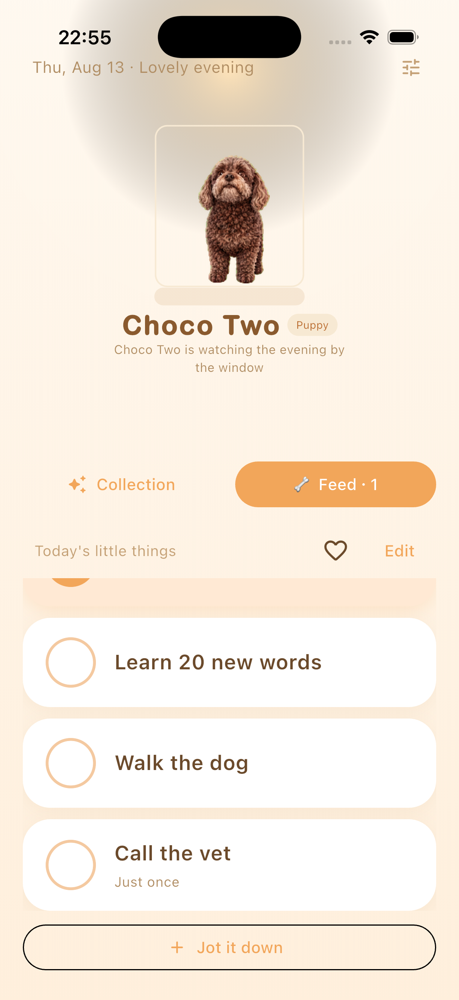
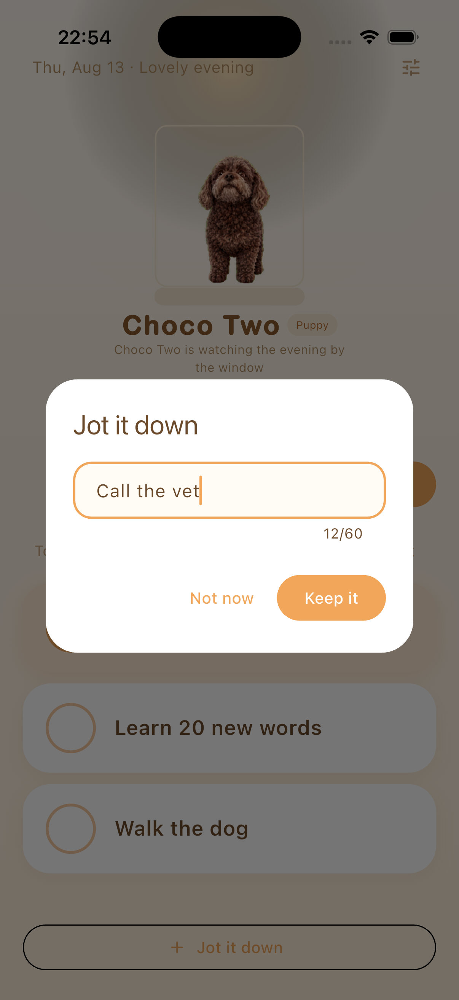
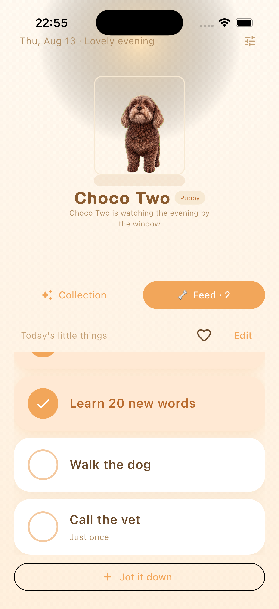
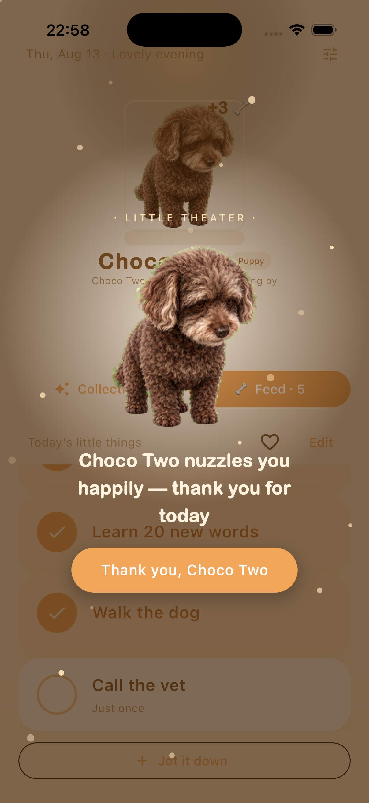
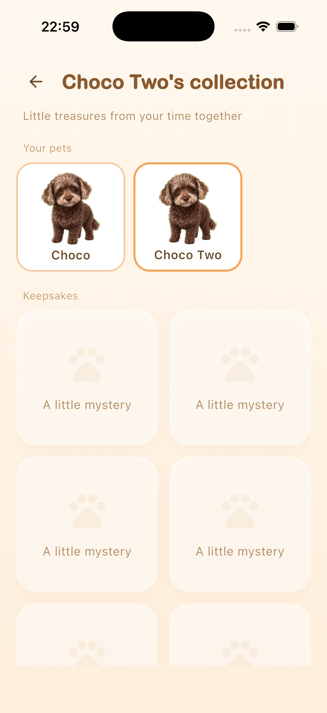
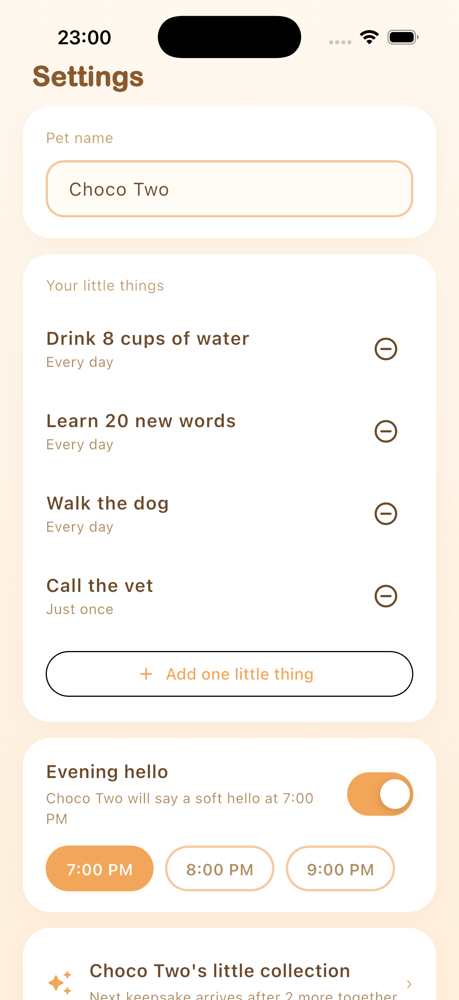

# Pawside — Progress Report

*(formerly PetTodo)*

---

## Abstract

Pawside is a mobile to-do application for adults with ADHD, built for iOS and
Android from one Flutter codebase. Its starting idea is simple: for this
population, gentle reminders rarely get a task started, but external anchors —
a child, a pet, another person who depends on you — often do. So instead of
sending reminders, Pawside gives the user a virtual pet generated from
photographs of their own animal, and frames a small daily task list as things
the user and the pet do together. Safety rules — no punishment, no streaks, no
failure states — are built into the data model rather than left to good
intentions.

For this report I tested that idea against four bodies of evidence: community
accounts, 4,754 app-store reviews, a structured literature search, and the
build itself. The most important finding goes against the design: the anchor
idea turns out to be the least evidenced part of it, while the
reminder-and-planning approach it set out to replace has controlled evidence
in diagnosed ADHD samples. The safety rules survived better, though studies of
trackers with no character and no failure state show that removing punishment
does not by itself remove guilt.

At the time of writing, the core loop is complete on both platforms and 58
automated tests pass. Since mid-term the project has also shipped a pixel-art
restyle, an ambient pet overlay on Android, a new generation pipeline that
turns photos into an animated pet in about a minute, and a rebuilt onboarding.
The remaining work is an evaluation designed to test the anchor mechanism
rather than assume it.

---

## 1. Introduction

### 1.1 Context and motivation

Most task-management software assumes the user can keep the system going. For
adults with ADHD this is backwards: the mental capacity needed to maintain a
productivity tool is exactly the capacity that is impaired. The specific
capacity is prospective memory — remembering to do a thing at the right
moment — and it does not fail evenly. In a case-control experiment, 25 adults
with diagnosed ADHD were strongly impaired on *time-based* intentions ("do X
at 7 pm") but performed like matched controls on *event-based* ones ("do X
after dinner")
([Altgassen, Kretschmer & Kliegel 2014](https://doi.org/10.1177/1087054712445484),
*Journal of Attention Disorders*). The population is also very mixed: across
six neuropsychological domains, no single deficit shows up in more than a
minority of diagnosed people — 18.1% to 36.1% depending on the domain
([Coghill et al. 2014](https://doi.org/10.1017/s0033291713002547),
*Psychological Medicine*). Whatever mechanism a tool builds will therefore
help a subgroup, not everyone — and that applies equally to the reminder
mechanisms this project set out to improve on.

What people with ADHD say works for them is concrete and external: a child, a
dog that must be walked, an alarm clock placed across the room — not
motivational messages. Pawside asks whether that observation survives being
built: can a virtual pet made from the user's own animal act as an external
anchor for small daily tasks?

### 1.2 Aims and objectives

Build and evaluate a to-do application whose engagement mechanism is an
external anchor rather than a reminder, without importing the guilt that has
caused similar applications to be abandoned. Objectives: (i) a dual-platform
core loop that works entirely offline, with no account and no server; (ii) a
pet generated from the user's *own* animal, on the hypothesis that attachment
to a real, recognisable companion is stronger than attachment to a generic
avatar; (iii) safety red lines — no punishment, no streaks, no failure
states — enforced by the structure of the code, not by discipline; (iv) an
evaluation against a retention criterion, where the criterion itself is
examined rather than assumed.

### 1.3 Background

#### 1.3.1 The problem: abandonment, not absence of features

The best documentation of how this category fails comes from its own users. I
read high-engagement threads across r/ADHD, r/adhdwomen and
r/ADHD_Programmers — including a 4,625-upvote account of 500 days spent
trialling 36 productivity applications — and three patterns repeat. First,
more features do not fix the problem: the top-voted example is a user who
built himself an app that read his email, prioritised it automatically and
contacted him every morning — and he still did not use it. The barrier is not
friction; it is getting started at all. Second, maintaining the tool is itself
an executive-function task, so the tool decays exactly when the user does.
Third, the community has its own evaluation standard: early reviews are
worthless because ADHD reviewers chase novelty, and only two-week retention
convinces anyone. One serial abandoner supplied the phrase this project now
designs against: an app that "feels like my disappointed mother", where the
user feels "guilty about the app I downloaded to stop feeling guilty about
tasks". Commenters have a name for this state: a *shame reminder*.

#### 1.3.2 Survey of existing systems

I surveyed the four dominant applications in this space using 4,754 store
reviews collected for this report (method and sampling caveats in §2.2), their
public store metadata, and hands-on sessions with each app on my own device.
Figure 1 shows one representative screen from each.

**Figure 1 — The four surveyed applications.** Left to right: Finch (pet above
the day's self-care tasks), Tiimo (visual timeline planner), Habitica (RPG
stats; the guide text warns "if you miss one, your avatar will take damage
overnight"), and Numo (task list with instant point rewards). Finch, Tiimo and
Habitica were captured on my own Android device (Tiimo running in Chinese);
the Numo panel is the developer's own store-listing image, as the correct Numo
could not be re-captured in time for this report.

**Finch** (virtual bird plus self-care tasks; 739K App Store ratings at 4.9★,
10M+ Play installs) is the category leader and the reference product for the
pet mechanism. Emotional-bond language ("my birb", "companion", "attached")
appears unprompted in 29% of its recent Apple reviews, against 9–13% for the
other three — the clearest external evidence that the pet does something the
other mechanisms do not. Its failure modes are just as instructive: guilt on
lapse severe enough that users stop opening the app; users faking completions
to earn pet rewards, and recognising the self-deception while doing it; an
aesthetic adults repeatedly call infantile; and — its top-voted Android
complaint — data loss, with multi-year pets wiped and users explicitly asking
for a manual backup button the product does not provide. One detailed review
also locates where the mechanism works: the pet reward does not move large
goals ("being rewarded by buying clothes for a virtual bird isn't enough
motivation"), but it does move small daily maintenance — finishing a bottle of
water, stretching, taking medication — and the app is opened *to see the pet*,
with reminders read incidentally.

**Tiimo** (visual daily planner; Apple "app of the year" laurels) shows a
sharp split between its 4.6★ cumulative rating and its recent reviews, 28.6%
of which are one-star; its biggest complaint cluster is notifications, and it
barely exists on Android. **Habitica** (RPG-style gamification, 5M+ Play
installs) is the clearest demonstration of the punishment problem this
project's red lines answer: its angriest reviews are about losing levels to a
boss fight, and it has a years-long, still-open wound around Android
notifications failing under battery management or arriving in overwhelming
batches. **Numo** positions itself as the non-infantile ADHD app — the same
positioning this project targets — but is burning it: 29% of its reviews
concern billing disputes, and its Android rating has collapsed to 3.29★. A
newer cluster of quest-style apps (Hyper, TaskHero, LifeUp) competes for the
same users with "levelling up, not being told what to do".

**Figure 2 — Three mechanisms from the category leader that Pawside
deliberately leaves out.** Left to right: Finch's streak counter ("1 DAY
STREAK"), its seven-day free-trial offer with a countdown, and its cosmetics
shop. Each maps to a documented failure mode: streaks to guilt on lapse,
subscription pressure to the category-wide billing complaints, and cosmetic
rewards to the reported ceiling of the pet mechanism.

Three design consequences follow. The pet-bond mechanism is validated and its
ceiling untouched. Data loss is existential for an emotional product — and
*worse* for Pawside, whose pet is irreplaceable and whose storage is
local-only. And subscription dark patterns are a category-wide trust failure
that a competitor can differentiate against simply by not committing them.

#### 1.3.3 The evidence on the design premises

Before this report I treated the anchor mechanism as established and the
safety rules as obviously sufficient. I ran a structured literature search
across sixteen questions to check both (method in §2.2). It changed my
position on each, and this report states the revised positions instead of
defending the original ones.

**The anchor mechanism is not an established finding.** The only controlled
test of "body doubling" — working alongside another person — found no effect
in 26 participants
([Schuenke et al. 2025](https://doi.org/10.1145/3663547.3759743)), and the
broader social-facilitation meta-analysis puts mere presence at 0.3–3% of
variance, and finds it *impairs* complex tasks
([Bond & Titus 1983](https://doi.org/10.1037/0033-2909.94.2.265)). Animal
care has never been tested as a task-initiation aid in ADHD adults. Nothing I
retrieved supports the chain *human presence helps → animal responsibility
helps → a photo-derived virtual animal helps*. Pawside is therefore
**testing** a mechanism, not implementing a proven one, and this report makes
its claims accordingly.

**The approach it rejected does work.** If-then implementation planning
improves inhibition, shifting and distraction resistance in children with
diagnosed ADHD
([Gawrilow & Gollwitzer 2008](https://doi.org/10.1007/s10608-007-9150-1)), on
top of a large general-population meta-analysis
([Gollwitzer & Sheeran 2006](https://doi.org/10.1016/s0065-2601%2806%2938002-1)).
The slogan "reminders do not work, anchors do" gets the evidence backwards.

**Removing punishment does not remove guilt.** Guilt shows up after
abandonment even in self-trackers with no character, no failure state and no
punitive feedback — 16.2% of activity-tracker users
([Epstein et al. 2016](https://doi.org/10.1145/2858036.2858045)) — because the
user's own judgement generates it. Giving something a face raises the felt
cost of abandoning it
([Chandler & Schwarz 2010](https://doi.org/10.1016/j.jcps.2009.12.008)), and
an analysis of 582 r/Replika posts found harms driven by role-taking: users
felt the character had needs they were obliged to meet
([Laestadius et al. 2024](https://doi.org/10.1177/14614448221142007)). The
zero-punishment red line is necessary but not sufficient, and the *shame
reminder* finding says the same thing from the user's side.

**The one experiment that varied pet feedback found warmth-only inert.**
Adolescents whose virtual pet gave both positive and negative feedback were
roughly twice as likely to eat breakfast; the positive-only pet did not beat
the control ([Byrne et al. 2012](https://doi.org/10.1080/17482798.2011.633410)).
The sample is adolescent, the outcome is breakfast, and guilt was not
measured — but it is the closest existing test of this project's central
safety rule, and it is not reassuring. I keep the rule as an ethical
commitment; the evaluation must be able to see whether warmth-only is
*enough*.

**Three claims I had been repeating are withdrawn.** The
"prefrontal-to-amygdala switch" story about urgency-driven initiation falls
apart when its sources are read: the finding concerns acute uncontrollable
stress causing *impairment*, largely in animals
([Arnsten 2015](https://doi.org/10.1038/nn.4087)), while ADHD prefrontal
regions are *under*-active. The "5–10% transfer rate" for single-mechanism
ADHD interventions does not exist in the literature; it is demoted to
attributed practitioner opinion. And the 1–7 task cap cannot cite Miller:
"seven plus or minus two" is about immediate memory span, and Cowan calls the
seven a rhetorical device
([Cowan 2001](https://doi.org/10.1017/s0140525x01003922)). The cap is instead
defended by the observation in §1.3.2: small daily maintenance is where the
pet mechanism works at all.

**What the evidence does support.** Warmth-only *reinforcement* has a direct
ADHD result: on an incentive go/no-go task, participants with ADHD gained
more from social reward — positive facial expressions — than controls did
([Kohls et al. 2009](https://doi.org/10.1186/1744-9081-5-20)). And the
event-based cue is the best-grounded interaction choice available, given the
prospective-memory dissociation in §1.1. This also matches the cue type
independently proposed by the early-years special-needs specialist whose
feedback my supervisor forwarded — a concrete relative anchor ("can we finish
this before they finish making your lunch") — rather than the clock-triggered
daily prompt I currently implement.

---

## 2. Methodology

### 2.1 Engineering method

**Platform: Flutter, not two native apps.** Both options produce a good
product; the deciding factor is scope. Evaluation needs real users on
whatever handset they own, and a solo project cannot keep two native
codebases at that standard. The cost is accepted openly: surfaces Flutter
cannot reach must be written natively — which is exactly what happened with
the Android overlay, written in Kotlin (§3.4), and will happen again with the
iOS widget.

**Architecture: boundaries before features.** Figure 3 shows the structure of
the codebase. `lib/domain/` is pure Dart with no Flutter imports and owns the
product's rules — the one-to-seven task cap, local-day rollover,
positive-only history, treat economy and unlock thresholds. `lib/data/` owns
storage, notification scheduling and pet-pack install. `lib/sprite/` owns pet
rendering. `lib/application/` is a coordinator that knows nothing about
widgets, deliberately kept outside `lib/ui/`.

**Figure 3 — Code structure.** The Flutter application and the two things
that live outside it: the hatch route that turns photos into a pet, and the
native surfaces Flutter cannot reach.

The dependency arrows only point one way, which is what makes the safety
rules testable. To see why, follow one tap through the layers. When the user
ticks a task, the widget calls the coordinator; the coordinator asks the
domain layer to complete the task; the domain layer checks the rules, emits a
completion event and a treat; the data layer appends the event to the log and
rewrites the state file atomically; the UI rebuilds from the new state and
the sprite layer plays the happy animation. At no point can a widget touch
storage directly, and none of the rules need a widget to be tested. The same
boundary was demonstrated in practice twice: the approved visual design, and
later the full pixel restyle (§3.3), were both applied without touching
domain logic.

**Rendering: a small `CustomPainter`, not a game engine.** The Flame engine
would also do the job, and would be the obvious choice for a game. But a
game-engine dependency for one animated actor is out of proportion, and it
would move animation state out of the layer the tests can reach.

**Data: local files, not a database, not a cloud.** State is one versioned
JSON document written by flush-then-rename; events are append-only
newline-delimited JSON. SQLite would be a fine alternative — but JSON files
keep export and import human-readable, need no migration tooling beyond a
version field, and make "your data is a file you can hold" literally true.
There is no account, no server and no analytics. The reasons are partly
ethical — the community research records explicit refusal to hand
mental-health-adjacent data to small developers' cloud services — and partly
methodological, because it makes evaluation possible without data
infrastructure. §5 records the cost: retention cannot be measured the way any
cited study measures it. The one server this project now has, the hatch proxy
(§3.5), holds no user data: it exists to keep the image-model key off the
device and to enforce quotas.

**Process.** Every change starts from a written task specification stating
goal, file scope, constraints and acceptance criteria. I accept a change only
after reading the full diff and running the build and tests locally;
user-visible changes are also walked through on a device or simulator. Every
feature must state which ADHD problem it solves; if that mapping cannot be
stated, the feature is not built. This constitution is written down and
version-controlled alongside the code, and several of its rules are enforced
by tests rather than by discipline (§5).

Table 1 collects the main design decisions, the strongest alternative to
each, and the factor that decided it.

**Table 1 — Design decisions and the alternatives they were weighed against.**

| Decision | Chosen | Strong alternative | What decided it |
|---|---|---|---|
| UI framework | Flutter | Native Swift + Kotlin pair | Both give a quality UI; one codebase keeps a solo project able to reach evaluation on both platforms |
| Pet rendering | `CustomPainter` + `Ticker` | Flame game engine | One animated actor does not justify an engine; keeps animation state in the tested layer |
| Storage | Versioned JSON + JSONL log | SQLite | Both are reliable; files keep export human-readable and the "no server" promise literal |
| Animation source | v3 rig pack: 4 poses + skeleton | v2 per-frame generation | Both produce a recognisable pet; v2 took ~40 min per pet and drifted between frames, v3 takes ~1 min and moves deterministically (§3.5) |
| Visual style | Pixel art ("Cozy Pixel") | Soft photo-derived style | Soft style scored well on warmth but could not hold a stable silhouette (§4.4); pixel art is stable and answers the "infantile" objection |
| Notification cue | Event-based (planned, §6) | Time-based clock prompts | Time-based prospective memory is impaired in ADHD adults; event-based is spared |

### 2.2 Research method

Four bodies of evidence were gathered, deliberately of different kinds so
each could check the others.

*Community accounts.* I read high-engagement threads and their top comments
across three ADHD subreddits in two sweeps — one on tool abandonment, one on
the condition's daily texture — recording per-thread links and vote counts so
every claim stays traceable.

*Store reviews.* I collected 4,754 reviews via the public Apple review feed
(1,154: Finch 400, Tiimo 350, Numo 254, Habitica 150) and a Play scraper
(3,600: Finch 1,612, Habitica 1,537, Numo 339, Tiimo 112), deliberately
oversampling one- to three-star reviews on the Play side. That choice is
recorded next to every figure it affects: Play proportions show how
*concentrated* a complaint is, not how common it is in the population.

*Literature.* I ran a structured search across sixteen questions covering the
mechanism, the safety rules, and claims I had been repeating. Contradicting
evidence was treated as the most valuable output, and "no credible evidence
found" was recorded where that was the truth, rather than substituting
adjacent work. The result is a 230-row citation table recording, per row,
study design, sample, population mismatch, whether the claim is supported,
and retraction flags checked against both OpenAlex and Crossref (two flagged,
both disclosed). I also verified eight design-critical DOIs directly against
the Crossref API — all eight resolved with matching titles — and checked the
Altgassen finding line by line against the published abstract.

*Limitations, stated up front.* All the community strands sample
self-selecting, self-identifying, mostly English-speaking online populations.
Store reviews are written by people still using a product; Reddit is written
largely by people who left. Self-identification is itself a methodological
problem: executive-function rating scales and performance tests barely
correlate (median *r* = .19,
[Toplak et al. 2013](https://doi.org/10.1111/jcpp.12001)), so case-control
effect sizes cannot be carried over to a self-identifying sample — only the
weaker claim that self-rated difficulty predicts real functional impairment
([Barkley & Murphy 2010](https://doi.org/10.1093/arclin/acq014)).

---

## 3. Implementation

### 3.1 The core application

The core loop — tasks, sprite engine, unlocks, local notifications and the
JSONL event log — works on both platforms. On top of it:

**Design and accessibility.** The approved visual design, plus a semantics
rework: custom tap targets own container semantics above their gesture
handlers, decorative art is excluded from the accessibility tree, and
onboarding scrolls on short viewports.

**Raising system.** State schema v2 with in-place migration, growth stages
derived rather than stored, a treat economy, a full-day pet schedule,
long-press interaction, and a collection gallery with no progress bars.

**To-do baseline.** Schema v3. Tasks are ID-addressed objects of kind `daily`
or `oneOff`, capped at one to seven; quick capture requires only a title;
one-off tasks never carry age or overdue data. Positive history is derived
only from completion events and renders only weeks that contain
completions — no streak, gap, zero or missed-day state exists anywhere in the
product.

**Stability.** Two real defects found and fixed: a quick-capture crash on
dialog dismissal, and an Android release build that black-screened because
release resource shrinking stripped the notification icon. The fix for the
second also ensures a notification failure can never block startup again.

### 3.2 The own-pet loop, first version

The differentiating feature in its first form: the user photographs their
animal; the app assembles a request package; a sprite pack (`.pettodopet`)
produced by the image-generation pipeline is imported and installed
atomically; and a runtime registry merges bundled pets with installed packs.
A later change made onboarding list the live registry instead of one
hardcoded pet, and cleaned up exported request archives that had accumulated
indefinitely.

Living with this build daily — I am inside the target population, which the
evaluation treats as a stated limitation, not a secret — surfaced its main
weakness: the idle animation read as choppy. Measurement found the cause. The
six idle frames were generated independently, so 37–46% of pixels changed
between neighbouring frames and the silhouette drifted about 4 px — six
similar dogs rather than one dog breathing. The interim fix held a still
frame while the pet rests; the real fix is the v3 pipeline in §3.5.

### 3.3 The pixel restyle

The pixel-art experiment reported in §4.4 settled the style question, and the
decision has been carried through the whole product, not just the sprite. The
"Cozy Pixel" restyle gives the app stair-stepped borders, hard shadows, and
pixel fonts and icons; the bundled pet Choco was regenerated as pixel-art
canon with a full QA atlas. Because the restyle is confined to `lib/ui/` and
asset files, it landed without touching domain logic — the architectural
claim in §2.1, demonstrated a second time. The same wave carried a naming
change: the product took its release name, **Pawside**, replacing the working
title PetTodo, with paw-print imagery replacing the egg motif and user-facing
copy moving from "hatching" to "adoption" language. This report uses Pawside
throughout; repository paths and technical identifiers such as the
`.pettodopet` pack extension deliberately keep the old name. The retro
aesthetic is also a positioning answer: §1.3.2 documents adults calling the
category leader infantile, and pixel art reads as adult nostalgia rather than
as a children's toy.

### 3.4 The ambient layer on Android

The strongest single piece of user evidence in the review corpus is a
five-star review describing a widget's pet speaking to the user on a day they
had already given up. That surface is now built for Android: a floating
overlay, written natively in Kotlin, that keeps the pet on screen at a small
ambient size whatever the user is doing. The first build rendered the pet at
a third of the screen; the shipped version draws it at 1× — ambient means
peripheral. In line with the red lines, the overlay never speaks about tasks:
no reminders come from it, it is simply company. If the user declines the
overlay permission, the app continues silently and never asks again.

### 3.5 The hatch pipeline, second generation

The v2 pipeline (§3.2) produced its pet by generating every animation frame
as its own image: about 14 serial generations and roughly 40 minutes per pet,
with the inter-frame drift measured in §3.2, and the finished pack returned
to the user by hand. That route is now retired. The v3 pipeline generates
only four canonical poses — sitting with eyes open, the same pose with eyes
closed, curled asleep, and a side view — plus bounding boxes for the head,
tail and legs, and packs them as a "rig pack". Everything that moves is code:
a template skeleton drives breathing, blinking, gaze-following, a happy jump,
eating a treat, stretching, falling asleep and running, with motion quantised
to the pixel grid so it stays honest to the art style. Figure 4 compares the
two routes. A hatch now takes about a minute and costs roughly £0.03 (¥0.3)
in model fees, which makes hatching in-app viable: photos go from the app to
a small proxy backend that holds the image-model key, enforces a species gate
(cats and dogs only in v1), a per-account hatch quota, rate limits and cost
ceilings — and returns the finished pack straight to the device. No account
is created and no photos are retained server-side. Existing v2 pets keep
working: the renderer routes by pack format, and the two formats run side by
side. The "failed" reaction class present in early animation drafts is
permanently absent, by red line.

**Figure 4 — The two hatch routes.** v2 generated every frame; v3 generates
four poses and lets a skeleton do the moving.

The pipeline is a Python CLI (`tools/rig_pipeline/`, 25 tests) with retries
and best-of-two sampling built in, and it produced two engineering findings
worth recording. First, retry amplification: retrying at two layers meant a
single failing request could balloon to sixteen HTTP attempts, and permanent
client errors were being retried as if they were transient — the fix is one
retry layer and explicit error classification. Second, a geometry lesson: the
side-view tail detector originally judged which side the tail was on from the
canvas centre, which breaks the moment the subject is off-centre; it now
judges from the centre of the detected head box.

### 3.6 Onboarding, rebuilt around the relationship

The original onboarding introduced features. The rebuilt flow introduces the
pet first, on the reasoning that §1.3.2 supports: the app is opened to see
the pet, so the first minute should establish that bond. The user meets a
grid of adoptable pets ("Who's coming home?"), picks one, and names it — with
a dice button that rolls a name from a preset pool, so the single typing
moment has a zero-effort escape. They then pick up to three "little things"
from tappable chips (get out of bed, drink some water, take my meds…), with
typing needed only for a custom entry. A mid-point celebration awards the
first treat *before* any real task is done, so the reward loop is
demonstrated rather than described. On Android, the overlay from §3.4 is
offered as an invitation ("Can I stay on your screen?") through the same
never-re-ask permission flow. The user lands on Home with one free, scripted
first win — "Give {name} a pat" — which triggers the normal completion
celebration and does not count against the one-to-seven cap. Finally, the
evening check-in prompt moved out of onboarding entirely: the pet asks in
context on the first evening the app is open, which is also when notification
permission is requested. Existing users never re-run onboarding.

### 3.7 Held back deliberately

A rework of the notification layer — copy in the pet's voice, randomised
selection, timing jitter, and back-off after unopened days — is implemented
but unmerged, because the literature contradicts two of its three mechanisms.
§6 explains the conflict and the resolution path.

---

## 4. Results

### 4.1 The working application

All screenshots below are from one continuous session on an iPhone 17 Pro,
using a pet hatched from the user's own photographs. They are ordered as a
user would meet them. They record the build as it stood at mid-term, before
the pixel restyle of §3.3: layouts, wording and behaviour are current; the
visual style has since changed.

**Figure 5 — Home with a mixed task list.**

The pet takes the top half of the screen and the task list the bottom, and
that proportion is deliberate: the pet is not a decoration on a to-do list,
it is what the screen is about, and the tasks are what the user passes on the
way to it. The list shows both task kinds — three recurring items and *Call
the vet*, marked "Just once" — and that quiet subtitle is the only
distinction drawn. There is no due date, no age, no overdue marker and no
count of what remains; a one-off captured weeks ago looks exactly like one
captured this morning. The task area is a bounded scrolling region, so seven
items can never grow into a wall of text. The header reads "Today's little
things", and a completed item stays visible in a warm tint rather than being
struck through or removed.

**Figure 6 — Quick capture.**

Capture is two steps: tap *Jot it down*, type, confirm. The field is
autofocused, only a title is required, and the placeholder — "A thought
before it slips away" — names the problem this dialog solves: a thought that
leaves working memory in seconds cannot survive a form. Anything captured
here becomes a one-off by default, because demanding a recurrence decision at
capture time is exactly the friction that loses the thought. The dismissal
option says "Not now", not "Cancel" or "Discard".

**Figure 7 — Completing a task.**

Completion produces warmth and nothing else: the card takes a warm tint, the
circle fills, the pet plays a brief happy animation, and a treat drops — the
counter has gone from one to two. There is no score, no streak, no progress
bar and no "3 of 4 done" anywhere on screen, because a progress indicator is
also a deficit indicator. The treat is the only currency, it is spent on
feeding the pet, and spending it is optional.

**Figure 8 — The Little Theater, shown when the day's list is finished.**

Finishing everything on the list triggers the one moment the application
makes a fuss: the pet fills the screen, particles rise, three bonus treats
are awarded, and the message reads "Choco Two nuzzles you happily — thank you
for today". The dismiss button says "Thank you, Choco Two", keeping the
exchange between the user and the animal rather than between the user and a
scoreboard. This is the emotional peak of the design. It is also, by
construction, the *only* moment with this weight — there is no equivalent
screen for failure, because no failure state exists.

**Figure 9 — Positive history.**

The history screen is the clearest single expression of the safety
architecture. It reads "This week, you and Choco Two did 3 things together",
and lists only Thursday — because Thursday is the only day with completions.
Days without completions are not shown as empty, greyed or zero: **they do
not exist in the data model at all**, so no view can accidentally surface
them. There is no streak counter, no calendar grid with gaps that read as
failure, and no comparison with last week. The framing is "things we did
together", not "your completion rate".

**Figure 10 — The collection.**

Two things share this screen. The pet shelf shows the bundled pet and the
user's own hatched pet side by side, with the active one outlined — the
runtime registry from §3.2 made visible, and the point where the
differentiating feature becomes tangible. Below it, unlocked keepsakes appear
as illustrated items; locked ones show a paw silhouette and the words "A
little mystery". They carry no progress bar, no unlock threshold and no "2
more to go", so the gallery cannot be read as a list of things not yet
earned.

**Figure 11 — Settings.**

Settings is deliberately short. Tasks are listed with their kind stated in
words ("Every day" against "Just once") and removed with a single control;
there is no archive, no completed-items list and nowhere for finished work to
pile up. The notification section is one toggle and three fixed times, and
its subtitle is phrased as something the pet does rather than something the
user must configure. Notifications are off until explicitly enabled, and a
denied permission is never requested again.

### 4.2 The hatch loop, end to end

The acceptance walkthrough for the differentiating feature ran on the same
device from a clean install: onboarding → hatchery → photograph → export of a
139 KB request archive → import through the real iOS document picker → both
pets listed with the new one selected → switching between them → completing
onboarding → Home showing the imported pet with its hatch ceremony — ending
with zero leftover archives in documents. Two further screenshots taken
during that run record the ceremony and the resulting Home screen.

### 4.3 Implementation findings

Three findings from the build are results in their own right. A custom file
extension cannot be picked in the iOS document picker unless the app declares
it — the picker produces a dynamic UTI and Files greys the file out — fixed
by declaring `UTExportedTypeDeclarations`. Re-importing a pack for the
currently selected pet paints a disposed image during the asynchronous gap,
unless the replacement atlas is loaded before the old one is disposed. And
exported request archives accumulated indefinitely because cancellation
deleted the request folder but not the archive next to it — found by
inspecting the simulator's container, where the previous day's 139 KB archive
was still sitting.

### 4.4 A negative result turned decision: the pixel-art experiment

The fourth result began as a negative one and is reported as such. To test
whether a pixel-art style would improve frame-to-frame consistency, I first
generated a pixel version through the sprite pipeline's own pixel preset. The
output was not pixel art: 13,713 unique colours, against fewer than 32 for
the real thing. Mechanical post-processing — downsampling plus palette
quantisation — did produce true 23-colour pixel art but destroyed
recognisability, because the eyes and muzzle are defined by exactly the
detail that downsampling removes first. What worked was constraining the
generation itself: a 64×64 logical grid, blocks aligned to it, a 24-colour
palette, no anti-aliasing. That produced genuine pixel art that kept the
identity anchors — the silver-brown muzzle, the brow spots, the floppy-ear
silhouette. A six-frame idle strip built from that reference measured 14%
inter-frame drift after quantisation, against 42% for the then-current style,
with frame area stable to within 0.2 percentage points: the silhouette stops
breathing in and out between frames. The improvement was real but partial —
14% is still far above a hand-animated loop — which is why the style decision
and the pipeline decision were made together: pixel art made the frames
consistent (§3.3), and the rig made the motion deterministic (§3.5). The
aesthetic choice also answers the "infantile" objection documented against
the category leader in §1.3.2.

---

## 5. Testing and evaluation

### 5.1 Software testing

`flutter test` passes 58 tests across 20 files — a figure I verified by
running the suite, not by quoting it. The pipeline CLI carries its own suite:
25 tests across 6 files, run the same way. The unmerged notification rework
adds five more, including a lint that fails the build if invitation copy ever
regains a forbidden phrasing. Coverage concentrates on the promises the
product makes its users: schema v1→v2→v3 migration; day rollover, including
that rolling over multiple missed days leaves no historical markers; one-off
isolation from daily rollover; treat and unlock edges; the sorted, capped
notification window with one fire per task per day and no re-asking after
permission denial; local-week positive-history aggregation; JSONL
round-trips; sprite atlas frame mathematics; pack install and validation; and
accessibility semantics boundaries. The intent is that the red lines are
enforced by tests, not by discipline.

Gaps before submission: no end-to-end automated UI test; the Android overlay
and the rebuilt onboarding need device-level walkthroughs on more than my own
handset; and Android notification timing needs device-level verification,
because the review corpus shows scheduled notifications failing or arriving
in batches under OEM battery policies as a category-wide defect (111 of 1,537
Habitica Play reviews, 63 of them one or two stars).

### 5.2 User evaluation

The full plan is written up as a separate document. In summary: five to ten
seed participants who are ADHD-leaning pet owners, recruited through my
personal network only; a fourteen-day run; a short questionnaire at days 7
and 14; user-initiated local data export as the only data channel; and
qualitative red-light monitoring for guilt or uncanny reactions to the user's
own animal, treated as a finding that outweighs any retention number. Covert
recruitment in ADHD communities is ruled out both ethically and
pragmatically — the community research documents moderators publicly naming
products for stealth marketing. Ethics approval is the longest-lead-time item
and the first question for the school.

Two revisions to the evaluation follow from the literature, and are recorded
here because they change what the evaluation can claim. First, the community
benchmark of ">50% retention at two weeks" conflates two incompatible frames:
real-world median 15-day retention for mental-health apps is 3.9%
([Baumel et al. 2019](https://doi.org/10.2196/14567)), while recruited trials
run near 75% and report usage a median 4.06× higher than real-world use of
the same programs
([Baumel et al. 2019](https://doi.org/10.1093/tbm/ibz147)). A recruited seed
group is a trial population, so >50% is a weak bar in that frame and an
extraordinary one in the other — the report will state which frame it is in.
Second, two weeks is the wrong window anyway: the review corpus locates two
failure points, days 2–4 when setup enthusiasm fades, and roughly the second
month when novelty does. A day-60 check is added. Unblinded self-report is
also the most inflation-prone outcome in this field —
behavioural-intervention effects in children collapsed to non-significance
under probably-blinded assessment
([Sonuga-Barke et al. 2013](https://doi.org/10.1176/appi.ajp.2012.12070991)) —
so the analysis privileges the logged event data over questionnaire answers
wherever the two disagree.

---

## 6. Conclusion and future work

The application now does what it was specified to do, and the research
conducted for this report says the specification was partly wrong. That is
the honest summary, and the remaining work follows from it rather than from
the original plan.

**Resolve the notification design against the evidence.** The unmerged branch
implements randomised copy, timing jitter, and exponential back-off after
unopened days. The literature supports none of the three as mechanisms: the
closest test found a purpose-built 30-message bank no better than a single
fixed string ([Bell et al. 2023](https://doi.org/10.2196/38342)); jitter is
opposed by cue-consistency accounts of habit formation
([Lally et al. 2010](https://doi.org/10.1002/ejsp.674)); and one trial found
*less* frequent notification produced less viewing and actioning
([Morrison et al. 2017](https://doi.org/10.1371/journal.pone.0169162)).
Worse, withdrawing contact is ambiguous by construction, and rejection
sensitivity is defined as readily perceiving intentional rejection in
ambiguous behaviour
([Downey & Feldman 1996](https://doi.org/10.1037/0022-3514.70.6.1327)) — so
back-off may be a guilt pathway rather than a protection. The copy rewrite is
kept on separate grounds; the two mechanisms stay under review.

**Move from time-based to event-based cues.** The clearest evidence-led
change still unbuilt: anchoring a task to "after dinner" rather than to 19:00
uses the prospective-memory channel that is spared in ADHD adults rather than
the one that is impaired, and matches the cue type the forwarded expert
feedback independently proposed. The evening check-in's move out of
onboarding and into context (§3.6) is a first step in this direction.

**Design the return screen and an explicit pause.** Zero punishment does not
stop an accumulated backlog from speaking — the *shame reminder*. Two
mechanisms answer it: a first screen after absence that shows the pet's own
accumulated news rather than the user's arrears, and a deliberate pause
action that reframes absence as chosen rather than failed.

**Promote export to a user-facing backup.** The application is local-only,
the pet is generated from the user's own animal and is therefore
irreplaceable, and data loss is the top-voted complaint against the category
leader — which at least has accounts to restore from. The export mechanism
exists; making it a visible backup with an honest explanation is a small
change against a disproportionate risk.

**Finish the v3 rollout.** The pipeline, proxy and renderer exist (§3.5);
what remains is production and productisation: a roster of preset pets
generated through the same pipeline so the adoption grid offers real
variety, the one-off unlock flow for hatching a user's own pet, and the iOS
widget as the second ambient surface — which can now reuse the pixel asset
form the Android overlay draws.

**Evaluation.** Ethics enquiry, recruitment, the fourteen-day run with a
day-60 follow-up, and analysis. The outstanding intellectual work is deciding
what the project claims when its central mechanism is, on present evidence,
unproven — and running an evaluation honest enough to find out.
