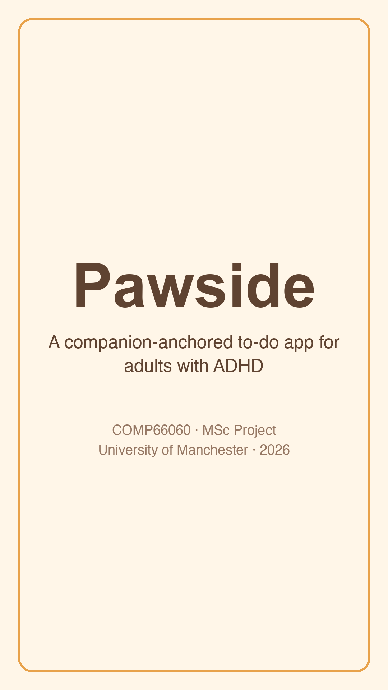
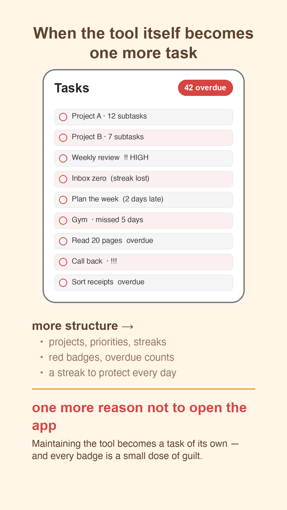
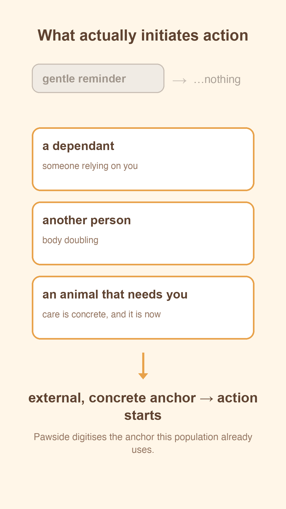
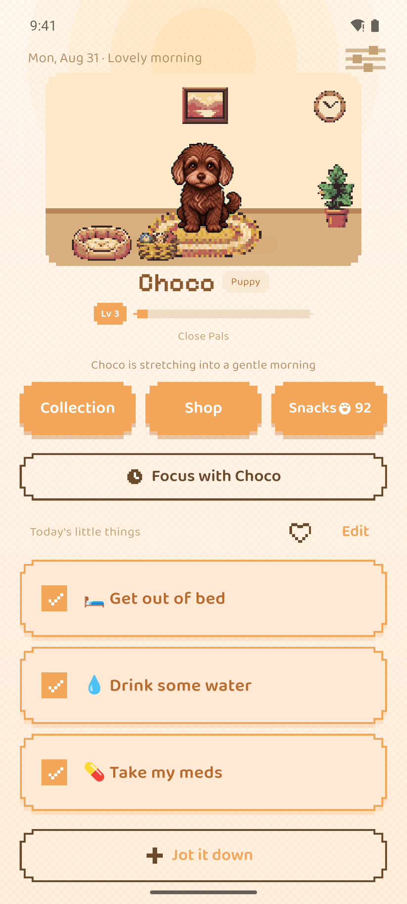
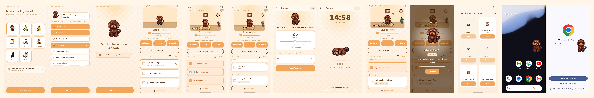
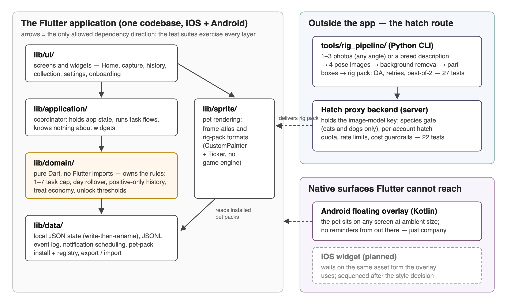
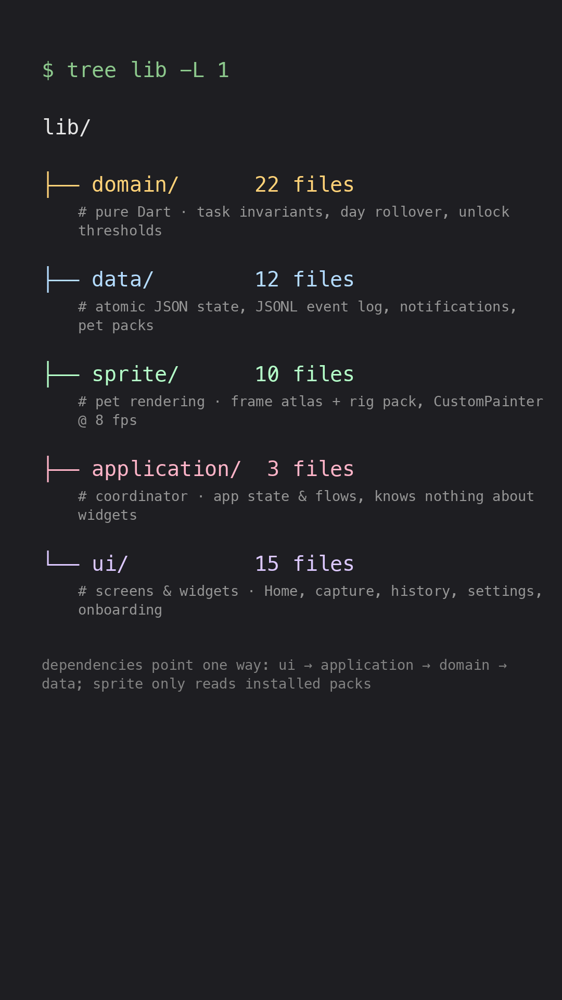
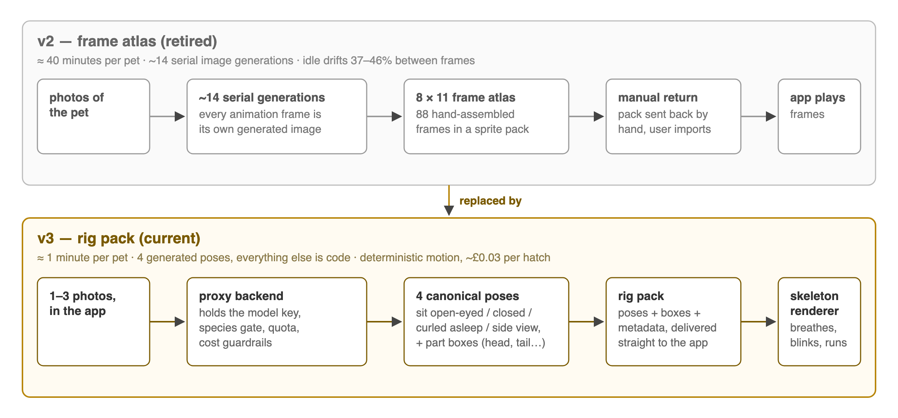
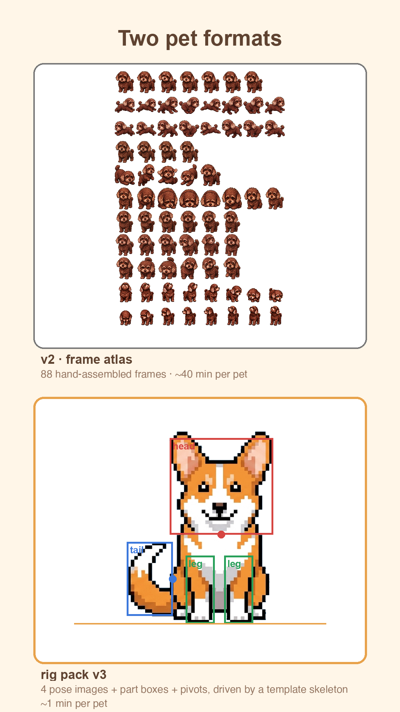
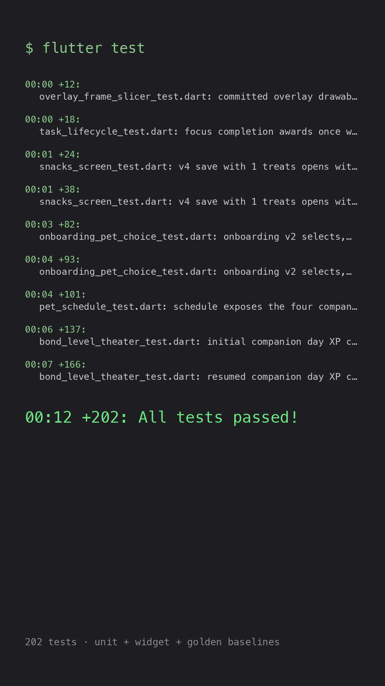

# 演示视频成片稿（分镜重排 + 英文旁白逐字稿）

> 2026-09-01 定稿。时长框架为导师要求：**开头介绍 1–1.5 分钟，产品功能 5–5.5 分钟，
> 技术与代码结构 1 分钟**，全片 ≈ 7:15–8:00。
> 录制调度、造号清单、红线自查沿用 [05-demo-shotlist.md](./05-demo-shotlist.md)；
> 本文件的分段时长与旁白为成片正典，与 05 冲突处以本文件为准。
> 旁白配速按 **140 wpm** 写就，各段词数已对齐时长，照念即可。
> 停顿标记：`/` 短停（约半秒）、`//` 长停（约一秒，换镜头/换意思）、**粗体** 重读。标记不念出来。
> 每段用「对位表」把画面与旁白逐行对上：录音按「旁白」列自上而下连读；剪辑按「秒标」列铺画面，旁白句末的 `//` 就是切镜点。秒标是节奏参考，画面比旁白短时让画面多停，不要赶。

## 时长总表

| 段 | 内容 | 目标时长 |
|---|---|---|
| Part 1 | 开头介绍（动机 + 设计论点） | 1:00–1:30 |
| Part 2 | 产品功能（9 个 clip，含孵化） | ≈5:30 |
| Part 3 | 技术与代码结构 | ≈1:00 |

---

## Part 1 · 开头介绍（60–90s，≈190 词）

Clip 1 冷启动全景在此消化，功能段不再单列。

| 秒 | 画面 | 旁白 |
|---|---|---|
| 0–10 | 标题卡：Pawside · MSc project COMP66060 | For adults with ADHD, / the hardest part of a task is rarely doing it — / it's **starting** it. // |
| 10–25 | 报告插图「工具本身变成任务」（或常规 todo app 满屏红角标的截图） | Conventional to-do apps answer this with more structure: / projects, / priorities, / streaks. / But for this population, / the tool itself becomes one more task to maintain, / and every red badge is one more reason **not** to open the app. // |
| 25–38 | 报告插图：外部锚点示意（依赖者 / 他人 / 动物），或一句用户访谈引语卡 | My user research pointed somewhere different: / what actually initiates action is an external, concrete anchor — / a dependant, / another person, / an animal that needs you. // |
| 38–62 | Clip 1 冷启动全景慢镜：宠物在房间 idle（呼吸/眨眼）、名字旁 bond 徽章+XP 条、Today's little things 一屏收齐 | Pawside is my attempt to digitise that mechanism. / It pairs a deliberately minimal to-do list — / one to seven items, no projects, no calendar — / with a virtual pet companion, / and it enforces one rule everywhere: / **zero punishment**. / There are no streaks, / no overdue states, / and the pet never reacts negatively. / Missing everything produces silence, / not guilt. // |
| 62–68 | 全景继续，可叠一行字幕「on-device · no account」 | Everything you do stays on the device — / no account. // |
| 68–85 | 快切预告：后面各 clip 各取 1 秒截帧（onboarding / 列表 / Coming up / 专注 / 投喂 / 房间 / 悬浮宠） | Over the next five minutes I'll walk through the app the way a user experiences it: / onboarding, / the task list, / reminders, / focus sessions, / feeding, / the pet's room, / and the floating companion. / I'll close with a minute on the architecture. |

**素材**（`figures/demo/`，1920×1080，可直接铺进时间线；Clip 1 全景与快切用你录的素材，下面第 6 张只是参考条）：

| 行           | 图                                                                                                                                                          |     |
| ----------- | ---------------------------------------------------------------------------------------------------------------------------------------------------------- | --- |
| 0–10 标题卡    |                                                                                                                         |     |
| 10–25 工具变任务 |                                                                                                             |     |
| 25–38 外部锚点  |                                                                                                               |     |
| 38–62 全景    | 你录的 Clip 1；备用截图                                                                                                              |     |
| 68–85 快切预告  | 单张用 `figures/app/` 里的 onboarding-v2 / home-room / coming-up / focus / feeding-levelup / shop / overlay-pet；参考条  |     |

---

## Part 2 · 产品功能（≈5:30）

录制调度（fresh/熟号两态只切一次）与造号清单仍看 05。

### Clip 2 · Onboarding（40s，fresh 态，≈90 词）

节奏加快，命名/选 chips 不犹豫。

| 秒 | 画面与操作 | 旁白 |
|---|---|---|
| 0–8 | 领养所 3×3 九宫格，滑一眼后点选一只宠 | Onboarding is built to establish the relationship / **before** asking for any productivity. // You choose a pet from the adoption shelter, / |
| 8–14 | 命名页，**点骰子按钮随机换名 1 次**再确认 | name it — / there's a dice button if naming feels like work — / |
| 14–22 | emoji chips 里点选三条 little things | then pick three "little things" from emoji chips, / so the first list fills itself in seconds. // |
| 22–27 | 中场庆祝动画完整放完 | Halfway through, / the app celebrates: / the important part is already done. // |
| 27–35 | 常驻邀请页 → 点同意 → Android 悬浮授权系统页允许 | The final step invites the pet to stay on your home screen — / entirely optional. / |
| 35–40 | 落到 Home，宠物已在房间，首胜提示收尾 | You land with your pet already living there. // Under a minute, / no account, / no tutorial. |

### Clip 2.5 · 孵化自家宠物（40s，≈75 词）

前置：Mac 上 `cd backend && GEMINI_API_KEY=… npm start` 起本地后端，手机与 Mac 同一
Wi-Fi，用拍摄包（孵化地址已指向 192.168.88.13:3000）。⚠️ 每台设备孵化配额 3 次，
排练别真提交；配额用完可清后端 `data/state.json`。

| 秒 | 画面与操作 | 旁白 |
|---|---|---|
| 0–8 | Settings → **Adopt your own pet**，入口特写 | And the pet doesn't have to be one of ours. // |
| 8–16 | 相册选 1–3 张真狗/猫照片（用你泰迪的照片），提交 | Pick one to three photos of your real pet, / and Pawside hatches them: / the photos go in, / |
| 16–24 | 孵化等待画面停一拍（真实生成几分钟，剪辑跳时） | and after a little wait, / |
| 24–34 | **孵出时刻**：自家宠以像素形态现身，切换为当前宠 | out comes **your own pet**, / redrawn as a living pixel companion. // This is the heart of the design — / the anchor isn't a mascot. / |
| 34–40 | 回主屏，自家宠已在房间里 idle | It's **your** pet, / the one you already care for, / now sitting beside your task list. |

### Clip 3 · Todo 及格线 + 正向历史（45s，≈100 词）

| 秒 | 画面与操作 | 旁白 |
|---|---|---|
| 0–8 | 主屏列表全貌停一拍（3 条常规 + 1 条 one-off，造号态） | The task list is capped at seven visible items — / an upper bound from user research, / below the point where a list turns avoidant. // |
| 8–16 | 勾掉一条 daily——**等游戏币掉落动画和宠物开心反应放完**再动 | Checking one off drops in-game currency, / and the pet reacts. / |
| 16–24 | 点添加，一行输入快速记一件 one-off | Adding a one-off takes one line; / |
| 24–30 | 进任务详情给它加一行 note，返回 | notes are there if you want them. // |
| 30–45 | 打开正向历史，停在「这周你和 {pet} 完成了 N 件」直到旁白念完 | And this is the history screen: / it only tells you how many things you and your pet finished this week. / There is no streak, / no red, / no count of what you didn't do. // That's the zero-punishment red line, / and it's enforced everywhere in the app — / not just here. |

### Clip 4 · 到时提醒（40s + 通知补拍镜头，≈90 词）

开拍即设提醒，随即转录 Clip 5，到点回来补拍。

| 秒 | 画面与操作 | 旁白 |
|---|---|---|
| 0–10 | 编辑那条 one-off，提醒区切到「日期+时间」形态——镜头先扫一眼 daily 的每日形态做对比 | One-off tasks can carry a timed reminder — / a concrete date and time, / distinct from the daily rhythm reminders. / |
| 10–18 | 设成 **3 分钟后**，保存 | Once set, / |
| 18–28 | 回主屏，「Coming up」区块出现、时间标签特写 | the task moves into a "Coming up" section with its time tag. // |
| 补拍 A（约 3 分钟后） | 通知横幅一响就录——宠物口吻邀请文案特写 → 点通知进 app | The notification, when it fires, / is written in the pet's voice — / an invitation, / not an alert — / and it fires exactly once. // |
| 补拍 B（时间过后） | 回主屏拍标签自动摘掉、任务回普通列表、无过期痕迹 | If the moment passes, / the tag simply comes off and the task returns to the list. / No overdue state, / no trace. // This is prospective memory, externalised, / without the guilt debt reminders usually accumulate. |

### Clip 5 · 专注 focus（40s，≈95 词）

| 秒 | 画面与操作 | 旁白 |
|---|---|---|
| 0–8 | 主屏点专注入口 | Focus sessions digitise body doubling — / working alongside someone. // |
| 8–16 | 滑条来回拖一下演示 5–45 分钟步长，停在 **15 分钟** | You pick a length, / five to forty-five minutes, / |
| 16–22 | 绑定一条今日任务，开始 | optionally bind one of today's tasks, / |
| 22–30 | 计时屏停留——宠物蜷睡陪伴，时间在走 | and your pet curls up and sleeps beside the timer. / Time becomes visible, / concrete, / and shared. // |
| 30–40 | （剪辑跳时）完成结算：+1 游戏币、温暖反馈、点一下「顺手标为完成？」可选按钮 | Finishing drops in-game currency and a warm acknowledgement, / plus an optional one-tap "mark it done". // |
| 补拍段 | 另起一次专注 → 中途提前结束 → 温暖回应特写（无惩罚） | And crucially — / ending early gets the **same** warmth. / There is no "session failed", / no withered plant. / The session simply ends, / and the pet is glad you stayed as long as you did. |

### Clip 6 · 投喂与羁绊（40s，≈88 词）

造号已把 bond XP 压到差一次投喂就升级。

| 秒 | 画面与操作 | 旁白 |
|---|---|---|
| 0–10 | 打开 Snacks 商店食物区，慢扫 7 件三档价目 | The second growth axis is bond. / You spend in-game currency on food, / |
| 10–18 | 买鸡肉丁（余额扣减入镜） | and feeding grants bond experience equal to the price. // |
| 18–28 | 投喂——宠物进食动画放完，XP 条上涨特写 | Here the bar fills / |
| 28–34 | **升级庆祝触发**：新称号+徽章特写停一拍 | and the bond levels up: / a new title, / a new badge, / a small celebration. // |
| 34–40+ | 回到主屏，名字旁新徽章+XP 条，宠物 idle 停留至旁白念完 | What's deliberately **absent** matters more: / there is no hunger meter. / The pet is never hungry, / never neglected, / and being away costs nothing. // Feeding is a gift, / not an obligation — / the mechanic rewards presence / without ever punishing absence. |

### Clip 7 · 房间与家具（40s，≈90 词）

造号累计 28 次完成，差 2 次到 30；留空槽位。

| 秒 | 画面与操作 | 旁白 |
|---|---|---|
| 0–10 | 连勾 2 条任务，累计到 30 | The pet lives in a room. / Furniture arrives two ways: / milestone pieces unlock free at cumulative completion counts — / |
| 10–20 | **宠物床解锁时刻**完整入镜 → 摆进地面槽位 | here, the thirtieth completion unlocks the pet bed — / |
| 20–32 | 逛商店家具区，用游戏币买星星串灯 | and shop pieces are bought with in-game currency. // |
| 32–40 | 摆上墙/角落槽 | Each piece goes into a fixed slot: / buy it, / and it's placed — / no fiddly dragging. // |
| 40–45 | 拉远房间全景收一眼（呼应温馨度加成） | The room also feeds back into the system: / a cozier room gives a small, capped bonus to bond gains, / so decorating the pet's home is itself an act of care. |

### Clip 8 · 悬浮宠（35s，Android 桌面，≈75 词）

用拍摄包：打开 app 后 2 分钟必弹气泡；录前打开 app → 10 秒内回桌面 → 掐 2 分钟。

| 秒     | 画面与操作                                 | 旁白                                                                                                                                       |
| ----- | ------------------------------------- | ---------------------------------------------------------------------------------------------------------------------------------------- |
| 0–8   | 从 app 退到桌面，悬浮宠出现（app 前台不显示，别在前台干等）    | Outside the app, / the pet can live on the Android home screen as a floating companion. / It idles quietly, /                            |
| 8–22  | 邀请气泡冒出——纯邀请文案特写，让它自然存在几秒（8s 自动消失，别等满） | and occasionally offers a small speech-bubble invitation — / pure invitation copy, / which disappears on its own after a few seconds. // |
| 22–30 | 点击气泡回到 app                            | Tapping it brings you back into the app. //                                                                                              |
| 30–35 | 主屏承接一拍                                | The anchor stays present in your environment, / the way a real animal does, / without ever demanding anything from you.                  |

### Clip 9 · 功能段收束（10s，≈25 词）

| 秒    | 画面与操作                                        | 旁白                                                                                                                                                                        |
| ---- | -------------------------------------------- | ------------------------------------------------------------------------------------------------------------------------------------------------------------------------- |
| 0–10 | 回到主屏全景，宠物 idle（呼吸/眨眼），镜头静止定格，念完直接切 Part 3 画面 | Task anchoring, / time externalisation, / and warmth-only feedback — / three intervention axes, / one companion. // That's Pawside. // Now, one minute on how it's built. |

---

## Part 3 · 技术与代码结构（60s，≈135 词）

| 秒 | 画面 | 旁白 |
|---|---|---|
| 0–12 | 分层架构图（domain / data / sprite / application / ui，可用报告插图），高亮 domain | Under the hood, / Pawside is a Flutter app with a strictly layered architecture. / The domain layer is pure Dart — / it owns the task invariants, day rollover, and unlock thresholds, / with no Flutter imports, / which makes it exhaustively unit-testable. // |
| 12–22 | IDE 里 `lib/` 目录树一扫，停在 `data/`（可点开 `app_state_store.dart` 露一眼） | The data layer handles persistence: / an atomic, versioned JSON state file / plus an append-only event log — / everything you do stays on the device, / with no account. // |
| 22–35 | 孵化后端一瞥：终端里 backend 运行日志，或 `rig_pipeline` 产物（正典姿势图 + 部件框叠加） | The one online step is hatching: / a small Node service turns your photos into canonical poses, / detects the part boxes, / and returns a self-contained rig pack — / after that, / your pet lives entirely offline. // |
| 35–50 | `sprite/` 目录 + 一只 v2 图集宠与一只 rig pack 宠并排（或 rig pack 文件结构） | Pets render through a custom painter at eight frames per second — / no game engine — / in two coexisting formats: / legacy frame atlases, / and rig pack v3, / where pose images plus part boxes drive a per-species template skeleton. // |
| 50–60 | 终端 `flutter test` 跑到 **202/202 全绿**收尾 | Two hundred automated tests, / including golden-image baselines, / guard all of it. |

**素材**（`figures/demo/` + 报告现成图）：

| 行 | 图 |
|---|---|
| 0–12 分层架构 |  |
| 12–22 lib/ 目录树 | （也可直接录 IDE） |
| 22–35 孵化在线步骤 |  |
| 35–50 两种格式并排 |  |
| 50–60 测试全绿 | （真实输出截取，也可现场录终端） |

---

## 配音自查

- 全片旁白 ≈1,050 词 ≈ 7:30 @140 wpm；某段念快了别赶，宁可画面多停半秒。
- 词汇跟 CONTEXT.md 正典：adopt（不说 buy/unlock）、货币一律说
  **in-game currency**（不说 snacks/treats；Snacks 只作商店名）、bond、
  focus session（不说 pomodoro）、Coming up。
- 红线自查沿用 05：全片不得出现 streak/overdue/惩罚反应/催促文案。
